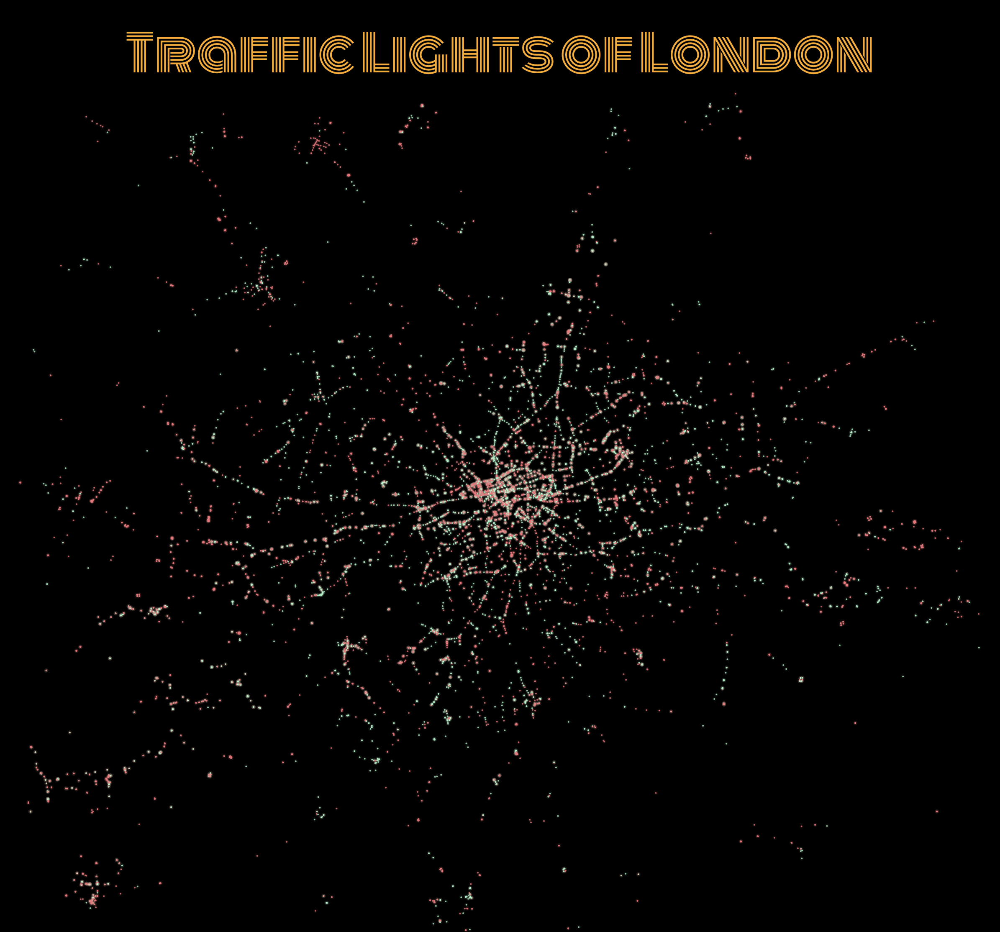
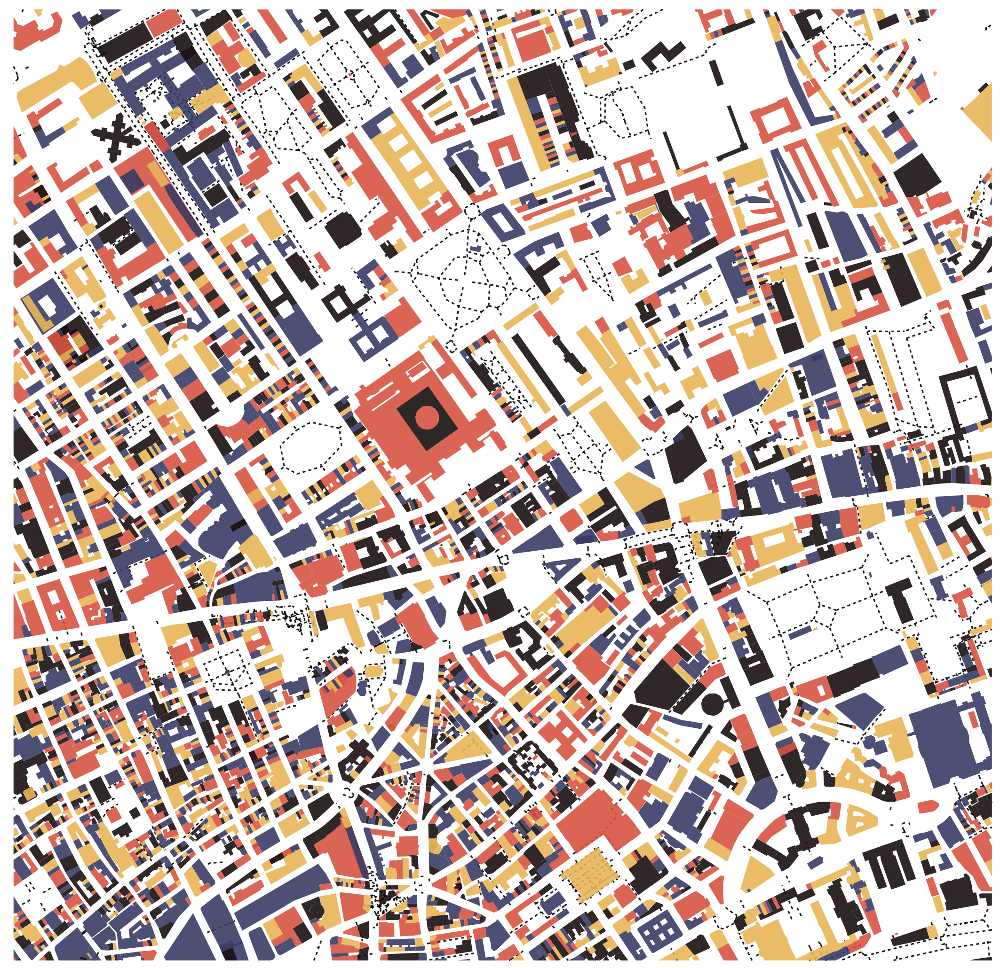
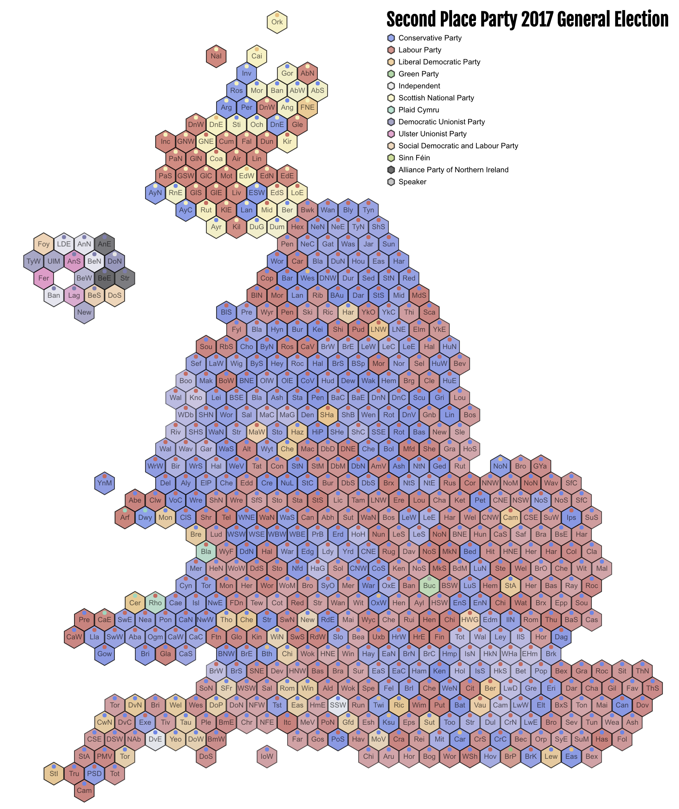

# 30 Day Map Challenge

Maps created as part of [Topi Tjukanov's #30dayMapChallenge](https://twitter.com/tjukanov/status/1187713840550744066).

All produced using [LitVis](https://github.com/gicentre/litvis), combining markdown with [Vega-Lite](https://vega.github.io/vega-lite)

| Day | Theme                      | Map                                                        |
| --: | :------------------------- | :--------------------------------------------------------- |
|   1 | [points](d01Points.md)     |    |
|   2 | [lines ](d02Lines.md)      |     |
|   3 | [polygons](d03Polygons.md) |  |
|   4 | [hexagons](d04Hexagons.md) |  |
|   5 | [raster]                   |                                                            |
|   6 | [blue]                     |                                                            |
|   7 | [red]                      |                                                            |
|   8 | [green]                    |                                                            |
|   9 | [yellow]                   |                                                            |
|  10 | [black and white]          |                                                            |
|  11 | [elevation]                |                                                            |
|  12 | [movement]                 |                                                            |
|  13 | [tracks]                   |                                                            |
|  14 | [boundaries]               |                                                            |
|  15 | [names]                    |                                                            |
|  16 | [places]                   |                                                            |
|  17 | [zones]                    |                                                            |
|  18 | [globe]                    |                                                            |
|  19 | [urban]                    |                                                            |
|  20 | [rural]                    |                                                            |
|  21 | [environment]              |                                                            |
|  22 | [built environment]        |                                                            |
|  23 | [population]               |                                                            |
|  24 | [statistics]               |                                                            |
|  25 | [climate]                  |                                                            |
|  26 | [hydrology]                |                                                            |
|  27 | [resources]                |                                                            |
|  28 | [funny]                    |                                                            |
|  29 | [experimental]             |                                                            |
|  30 | [home]                     |                                                            |
