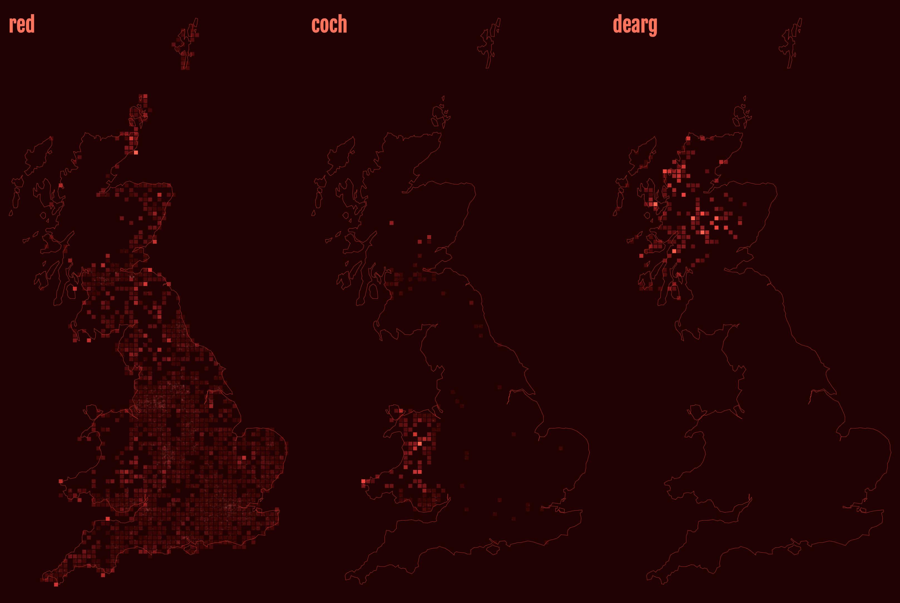

@import "css/litvis.less"

```elm {l=hidden}
import VegaLite exposing (..)
```

# 30 Day Map Challenge, Day 7: Red

_This document best viewed in [litvis](https://github.com/gicentre/litvis)_

## Initial Thoughts

Would be an opportunity to examine place names. Perhaps density map of the letters 'R-E-D' in a gazetteer shown as large transparent circles to create a pseudo density map? Could also consider Welsh ('coch') and Scottish and Irish Gaelic ('dearg'). Should probably map proportion of red names not absolute numbers in order to avoid population problem. Perhaps three maps? Could use either OSM or, more conveniently, the Ordnance Survey OpenNames dataset.

## Data Preparation

1. OS OpenName dataset comes as a collection of separate CSV files, one for each 100km grid square. Combine these grid square name files, filtering out any entries of type 'other' (postcodes) and extract only the name, easting and northings from the combined file:

```
cat *.csv >combined.csv
grep -v "other" combined.csv >allNames.csv
ruby -rcsv -e 'CSV.foreach(ARGV.shift) {|row| print row[2],"\t",row[8],"\t",row[9],"\n"}' allNames.csv >gbAllNames.tsv`
```

2. Create filtered versions containing only names containing 'red', 'coch' and 'dearg':

```
echo -e "name\tlongitude\tlatitude" >gbRedNames.tsv
cat gbAllNames.tsv | grep  -i 'red' >>gbRedNames.tsv
echo -e "name\tlongitude\tlatitude" >gbCochNames.tsv
cat gbAllNames.tsv | grep  -i 'coch' >>gbCochNames.tsv
echo -e "name\tlongitude\tlatitude" >gbDeargNames.tsv
cat gbAllNames.tsv | grep  -i 'dearg' >>gbDeargNames.tsv
```

3. Create GB coastline using Ordnance Survey National Grid coordinate system:

```
mapshaper gbRegions.json \
 -dissolve2 name=coastline \
 -proj EPSG:27700 \
 -o format=topojson gbCoastlineOSGB.json
```

## Map Design

Could create a dot density map of named red places, which would be simple. But this would be dominated by the overall density of named places (Cities etc.). Better to show normalised rates by comparing the density of 'red' places with that of all named places.

Vega-Lite doesn't have any built-in 2d density functions, so need to aggregate points into grid squares. Would like to compare numbers of red and all named places in each square and colour accordingly. However, I'm not sure how to combine two transformed datasets (`lookup` only appears to work with a secondary data source, not a secondary data source with transformation), so a visual alternative is to show the underlying name density and overlay the 'red' points on top. Those points that are over-represented with red should stand out more against the background.

### Relative Density Test

To check the specification for 2d binning of point values into grid cells:

```elm {v}
densityTest : Spec
densityTest =
    let
        w =
            300

        h =
            300

        numRows =
            4

        numCols =
            4

        gSize =
            (w / numCols) * (w / numRows)

        allData =
            dataFromColumns []
                << dataColumn "easting" (nums [ 5, 15, 18, 25, 25, 25, 25, 35 ])
                << dataColumn "northing" (nums [ 22, 15, 12, 35, 32, 38, 25, 15 ])

        redData =
            dataFromColumns []
                << dataColumn "easting" (nums [ 15, 25, 35 ])
                << dataColumn "northing" (nums [ 15, 35, 15 ])

        trans =
            transform
                << calculateAs "floor(datum.easting / 10) * 10" "gCol"
                << calculateAs "floor(datum.northing / 10) * 10" "gRow"
                << calculateAs "datum.gCol+','+datum.gRow" "gLabel"
                << window [ ( [ wiAggregateOp opCount ], "numNames" ) ] [ wiGroupBy [ "gLabel" ] ]

        pointEnc =
            encoding
                << position X [ pName "easting", pQuant, pScale [ scDomain (doNums [ 0, 40 ]) ] ]
                << position Y [ pName "northing", pQuant, pScale [ scDomain (doNums [ 0, 40 ]) ] ]

        pointSpec =
            asSpec [ redData [], pointEnc [], circle [ maColor "#600" ] ]

        gridEnc =
            encoding
                << position X [ pName "gCol", pQuant, pScale [ scDomain (doNums [ 0, 40 ]) ] ]
                << position Y [ pName "gRow", pQuant, pScale [ scDomain (doNums [ 0, 40 ]) ] ]
                << color [ mName "numNames", mQuant, mScale [ scScheme "reds" [ 0, 1 ] ], mLegend [] ]

        gridSpec =
            asSpec
                [ allData []
                , trans []
                , gridEnc []
                , square [ maSize gSize, maOpacity 1, maXOffset (w / (2 * numCols)), maYOffset (-h / (2 * numRows)) ]
                ]
    in
    toVegaLite [ autosize [ asContent ], width w, height h, layer [ gridSpec, pointSpec ] ]
```

### Red Maps

It would appear that a list of 1.1 million names is too much for VegaLite to calculate in a reasonable length of time, so I've calculated the relative density externally in Java and saved the 10km grid square data as `gbRedDensity.csv`, `gbCochDensity.csv` and `gbDeargDensity.csv`.

```elm {l}
redMap : Spec
redMap =
    rMap "Red" "red"


cochMap : Spec
cochMap =
    rMap "Coch" "coch"


deargMap : Spec
deargMap =
    rMap "Dearg" "dearg"
```

```elm {l}
rMap : String -> String -> Spec
rMap colour tText =
    let
        w =
            500

        h =
            w * 2.104

        cfg =
            configure
                << configuration (coView [ vicoStroke Nothing ])

        redData =
            dataFromUrl ("data/gb" ++ colour ++ "Names.tsv") []

        redDensityData =
            dataFromUrl ("data/gb" ++ colour ++ "Density.csv") []

        boundaryData =
            dataFromUrl "data/gbCoastlineOSGB.json" [ topojsonFeature "coastline" ]

        proj =
            projection [ prType identityProjection, prReflectY True ]

        encDensity =
            encoding
                << position X
                    [ pName "easting"
                    , pQuant
                    , pAxis []
                    , pScale [ scZero False, scNice niFalse, scDomain (doNums [ 63820, 655620 ]) ]
                    ]
                << position Y
                    [ pName "northing"
                    , pQuant
                    , pAxis []
                    , pScale [ scZero False, scNice niFalse, scDomain (doNums [ -5000, 1240000 ]) ]
                    ]
                << color [ mName "density", mQuant, mScale [ scScheme "reds" [ 1.4, 0.6 ] ], mLegend [] ]

        redDensitySpec =
            asSpec [ redDensityData, encDensity [], square [ maSize 49, maOpacity 1, maXOffset 3.5, maYOffset -3.5 ] ]

        coastSpec =
            asSpec [ boundaryData, proj, geoshape [ maFilled False, maStrokeWidth 0.4, maStroke "rgb(205,0,0)" ] ]

        pointEnc =
            encoding
                << position X
                    [ pName "easting"
                    , pQuant
                    , pAxis []
                    , pScale [ scZero False, scNice niFalse, scDomain (doNums [ 63820, 655620 ]) ]
                    ]
                << position Y
                    [ pName "northing"
                    , pQuant
                    , pAxis []
                    , pScale [ scZero False, scNice niFalse, scDomain (doNums [ -5000, 1240000 ]) ]
                    ]

        pointSpec1 =
            asSpec [ redData, pointEnc [], circle [ maOpacity 1, maSize 9, maColor "#fee", maOpacity 0.01 ] ]

        pointSpec2 =
            asSpec [ redData, pointEnc [], circle [ maOpacity 0.7, maSize 0.2, maColor "#900" ] ]
    in
    toVegaLite
        [ cfg []
        , title (String.toLower colour) [ tiColor "rgb(218,78,59)", tiFont "Fjalla One", tiFontSize 36, tiAnchor anStart, tiOffset -50 ]
        , background "rgb(25,0,0)"
        , width w
        , height h
        , padding (paSize 20)
        , layer [ redDensitySpec, pointSpec1, pointSpec2, coastSpec ]
        ]
```


