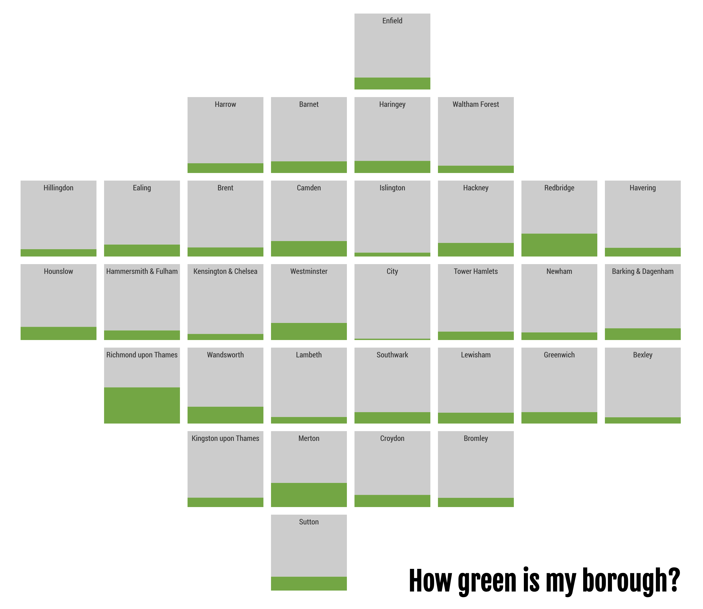

@import "css/litvis.less"

```elm {l=hidden}
import VegaLite exposing (..)
```

# 30 Day Map Challenge, Day 8: Green

_This document best viewed in [litvis](https://github.com/gicentre/litvis)_

## Initial Thoughts

How green is my borough? In a literal sense - proportion of land that is accessible green space. The Ordance Survey [open Greenspace](https://www.ordnancesurvey.co.uk/opendatadownload/products.html#OPGRSP) dataset contains polygons of accessible green space. Could clip to London boroughs and calculate land area proportion in each. Perhaps breaking down by function (park, alottment, cemetery etc.). Show as an 'after the flood' gridmap? With or without Thames?

## Data Preparation

1. Create `londonBoroughs.json` from [londonWards-2018.zip](https://data.london.gov.uk/dataset/statistical-gis-boundary-files-london))

2. Reproject [open Greenspace shapefiles](https://www.ordnancesurvey.co.uk/opendatadownload/products.html#OPGRSP)) in mapshaper to latlong WGS84, clip to Greater London area, extract the greenspace function, store each polygon's area in hectares, convert to centroid points and save as a topojson file:

```
mapshaper GB_GreenspaceSite.shp \
  -proj +init=EPSG:4326 \
  -clip londonBoroughs.json \
  -filter-fields id,function \
  -each 'greenArea=this.area/10000' \
  -points \
  -o format=topojson londonGreenCentroids.json
```

3. Generate `londonBoroughCentroids.csv` from `londonBoroughs.json` and manually add grid positions based on the [After The Flood grid layout](https://aftertheflood.com/projects/future-cities-catapult/).

4. Aggregate greenspace areas spatially grouping by borough and store total borough area, GSSCode and green area in a csv file:

```
mapshaper londonBoroughs.json \
 -join londonGreenCentroids.json fields= sum-fields=greenArea \
 -filter-fields GSSCode,area,greenArea \
 -o greenBoroughs.csv
```

## Map Design

Faceted plot using spatial grid positions to place simple stacked chart comparing proportion of land in each borough that is/is not accessible green space. While it might be a nice touch to add a Thames 'meander' to the grid cells adjacent to the river, this would overlay the narrow green strips at the base of many cells.

```elm {l}
greenMap : Spec
greenMap =
    let
        gSize =
            140

        border =
            gSize / 10

        cfg =
            configure
                << configuration (coView [ vicoStroke Nothing ])
                << configuration (coHeader [ hdLabelFontSize 0.1 ])
                << configuration (coFacet [ facoSpacing border ])

        data =
            dataFromUrl "data/londonBoroughCentroids.csv" []

        greenData =
            dataFromUrl "data/greenBoroughs.csv" []

        trans =
            transform
                << lookup "GSSCode" greenData "GSSCode" (luFields [ "greenArea" ])
                << calculateAs "datum.greenArea / datum.area" "green"
                << calculateAs "1 - datum.green" "notGreen"
                << fold [ "green", "notGreen" ]

        colours =
            categoricalDomainMap
                [ ( "green", "rgb(99,168,49)" )
                , ( "notGreen", "#ccc" )
                ]

        encGrid =
            encoding
                << position Y
                    [ pName "value"
                    , pQuant
                    , pAxis []
                    , pScale [ scRange (raNums [ 0, gSize ]) ]
                    ]
                << color
                    [ mName "key"
                    , mNominal
                    , mScale colours
                    , mLegend []
                    ]

        specGrid =
            asSpec [ encGrid [], bar [ maWidth gSize ] ]

        encLabel =
            encoding
                << text [ tName "fullName", tNominal ]

        specLabel =
            asSpec
                [ encLabel []
                , textMark
                    [ maFont "Roboto Condensed"
                    , maFontSize (gSize / 10)
                    , maY (gSize / 10)
                    , maOpacity 0.5
                    ]
                ]
    in
    toVegaLite
        [ cfg []
        , title "How green is my borough?"
            [ tiAnchor anEnd
            , tiOrient siBottom
            , tiFontSize (gSize / 2.9)
            , tiOffset (-gSize / 3.8)
            , tiFont "Fjalla One"
            ]
        , data
        , trans []
        , facet
            [ rowBy [ fName "gridRow", fOrdinal, fHeader [ hdTitle "" ] ]
            , columnBy [ fName "gridCol", fOrdinal, fHeader [ hdTitle "" ] ]
            ]
        , specification (asSpec [ width gSize, height gSize, layer [ specGrid, specLabel ] ])
        ]
```


