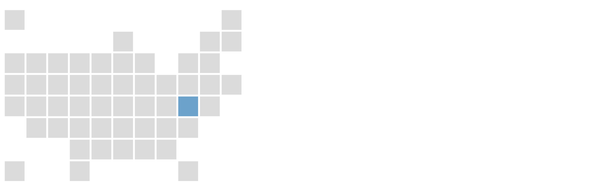
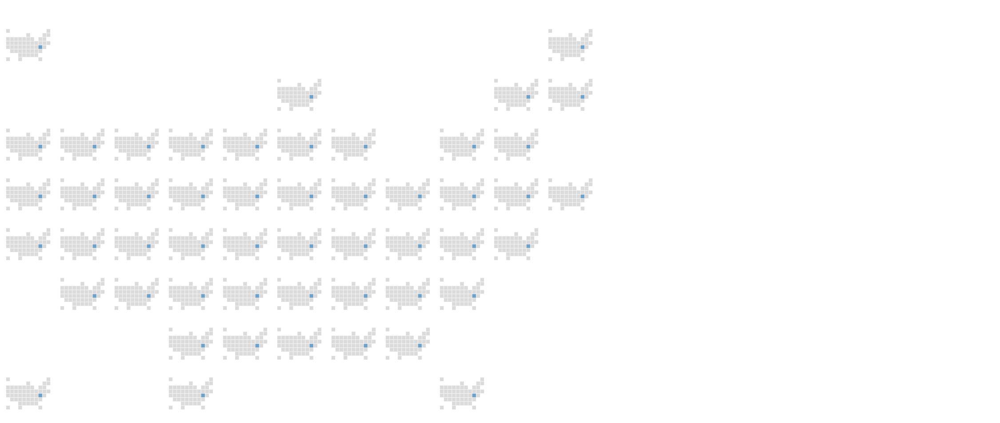

@import "css/litvis.less"

```elm {l=hidden}
import VegaLite exposing (..)
```

# 30 Day Map Challenge, Day 12: Movement

_This document best viewed in [litvis](https://github.com/gicentre/litvis)_

## Initial Thoughts

So many choices here. Could show a conventional flow map as arcs (as with [cycle movement across London](https://vimeo.com/66477874)). Could show an [OD map](https://openaccess.city.ac.uk/537/). I am also attracted by the idea of a simple map illustrating [Trump's claim to build a wall in Colorado](https://www.snopes.com/fact-check/trump-border-wall-colorado/) between the US and Mexico. But cartographically I think OD maps are more interesting, so will use US state-to-state migration as an example to illustrate this.

## Data Preparation

Estimated state-to-state migration data for 2018 are available from the [US Census Bureau](https://www.census.gov/data/tables/time-series/demo/geographic-mobility/state-to-state-migration.html).

The state migration figures were extracted from the spreadsheet, projected from a grid to a list and saved as `usStateMigration.csv`.

The gridded locations of each state were taken from [the arrangement described by Jonathan Schwabish](https://policyviz.com/2016/04/13/tile-grid-maps-in-excel/) and stored in the file `usGridmap.csv` that links US state names to their location on a 8x11 grid.

Location of generated files:

```elm {l}
path : String -> String
path file =
    "https://gicentre.github.io/data/30dayMapChallenge/" ++ file
```

## Experiments in OD Map Implementation in Vega-Lite

To illustrate the cartographic layout of a gridmap, we can symbolise each state square and its state label. This gives us the basic specification for projecting US states onto a grid. Note that the grid itself is a square (11 x 11 cells) but there are only 8 rows from north to south, so we use `scDomain` to centre those 8 cells within the grid.

```elm {l}
usGridmap1 : Spec
usGridmap1 =
    let
        cfg =
            configure
                << configuration (coView [ vicoStroke Nothing ])

        w =
            400

        stateData =
            dataFromUrl (path "usGridmap.csv") [ parse [ ( "row", foNum ), ( "col", foNum ) ] ]

        enc =
            encoding
                << position X
                    [ pName "col"
                    , pQuant
                    , pScale [ scNice niFalse, scZero False, scDomain (doNums [ 0, 10 ]) ]
                    , pAxis []
                    ]
                << position Y
                    [ pName "row"
                    , pQuant
                    , pSort [ soDescending ]
                    , pScale [ scNice niFalse, scZero False, scDomain (doNums [ -1.5, 8.5 ]) ]
                    , pAxis []
                    ]
                << text [ tName "state", tNominal ]

        squareSpec =
            asSpec [ square [ maSize (w * w / 120), maColor "#ccc" ] ]

        labelSpec =
            asSpec [ textMark [ maFontSize (w / 40), maOpacity 0.5 ] ]
    in
    toVegaLite [ cfg [], width w, height w, stateData, enc [], layer [ squareSpec, labelSpec ] ]
```


To show some quantitative value in a state, here's a specification without labels where each state is coloured by the amount of some value flowing into it. For illustration we will create a single flow to Maryland (MD). We can use the `usGridmap.csv` data source to convert any state name into its row and column position by using the `lookup` function.

```elm {l}
usGridmap2 : Spec
usGridmap2 =
    let
        cfg =
            configure
                << configuration (coView [ vicoStroke Nothing ])

        w =
            400

        stateData =
            dataFromUrl (path "usGridmap.csv") [ parse [ ( "row", foNum ), ( "col", foNum ) ] ]

        flowData =
            dataFromColumns []
                << dataColumn "to" (strs [ "MD" ])
                << dataColumn "volume" (nums [ 100 ])

        trans =
            transform
                << lookup "to" stateData "state" (luFields [ "col", "row" ])

        encPos =
            encoding
                << position X
                    [ pName "col"
                    , pQuant
                    , pScale [ scNice niFalse, scZero False, scDomain (doNums [ 0, 10 ]) ]
                    , pAxis []
                    ]
                << position Y
                    [ pName "row"
                    , pQuant
                    , pSort [ soDescending ]
                    , pScale [ scNice niFalse, scZero False, scDomain (doNums [ -1.5, 8.5 ]) ]
                    , pAxis []
                    ]

        encFlow =
            encPos
                << color [ mName "volume", mQuant, mLegend [] ]

        squareSpec =
            asSpec [ stateData, encPos [], square [ maSize (w * w / 120), maColor "#ccc" ] ]

        flowSpec =
            asSpec [ flowData [], trans [], encFlow [], square [ maSize (w * w / 120), maOpacity 1 ] ]
    in
    toVegaLite [ cfg [], width w, height w, layer [ squareSpec, flowSpec ] ]
```



Now let's repeat this gridmap for every state in the US by faceting the entire chart by the grid cell position of the state:

```elm {l}
usGridmap3 : Spec
usGridmap3 =
    let
        cfg =
            configure
                << configuration (coView [ vicoStroke Nothing ])
                << configuration (coHeader [ hdLabelFontSize 0.1 ])
                << configuration (coFacet [ facoSpacing 10 ])

        w =
            500 / 11

        stateData =
            dataFromUrl (path "usGridmap.csv") [ parse [ ( "row", foNum ), ( "col", foNum ) ] ]

        flowData =
            dataFromColumns []
                << dataColumn "to" (strs [ "MD" ])
                << dataColumn "volume" (nums [ 100 ])

        trans =
            transform
                << lookup "to" stateData "state" (luFields [ "col", "row" ])

        enc =
            encoding
                << position X
                    [ pName "col"
                    , pQuant
                    , pScale [ scNice niFalse, scZero False, scDomain (doNums [ 0, 10 ]) ]
                    , pAxis []
                    ]
                << position Y
                    [ pName "row"
                    , pQuant
                    , pSort [ soDescending ]
                    , pScale [ scNice niFalse, scZero False, scDomain (doNums [ -1.5, 8.5 ]) ]
                    , pAxis []
                    ]

        squareSpec =
            asSpec [ stateData, enc [], square [ maSize (w * w / 120), maColor "#ccc" ] ]

        encFlow =
            enc
                << color [ mName "volume", mQuant, mLegend [] ]

        flowSpec =
            asSpec [ flowData [], trans [], encFlow [], square [ maSize (w * w / 120), maOpacity 1 ] ]

        dMapSpec =
            asSpec [ width w, height w, layer [ squareSpec, flowSpec ] ]
    in
    toVegaLite
        [ cfg []
        , stateData
        , facet
            [ rowBy [ fName "row", fOrdinal, fHeader [ hdTitle "" ] ]
            , columnBy [ fName "col", fOrdinal, fHeader [ hdTitle "" ] ]
            ]
        , specification dMapSpec
        ]
```



But so far we have repeated the same map, once for each state. Instead we can store the separate grid positions for origin and destinations, faceting by origin position but displaying the flow magnitudes at the destination position. This gives us our OD map.

It would be trivial to swap the origins and destinations, giving a set of origin maps by simply swapping the `from` and `to` fields in the `trans` function.

```elm {l}
usMigrationODMap : Spec
usMigrationODMap =
    let
        cfg =
            configure
                << configuration (coView [ vicoStroke Nothing ])
                << configuration (coHeader [ hdLabelFontSize 0.1 ])
                << configuration (coFacet [ facoSpacing 10 ])

        w =
            1200 / 11

        stateData =
            dataFromUrl (path "usGridmap.csv") [ parse [ ( "row", foNum ), ( "col", foNum ) ] ]

        flowData =
            dataFromUrl (path "usStateMigration.csv") [ parse [ ( "volume", foNum ) ] ]

        trans =
            transform
                << lookup "from" stateData "state" (luFieldsAs [ ( "col", "oCol" ), ( "row", "oRow" ) ])
                << lookup "to" stateData "state" (luFieldsAs [ ( "col", "dCol" ), ( "row", "dRow" ) ])

        labelTrans =
            transform
                << filter (fiExpr "datum.from == datum.to")

        encPos =
            encoding
                << position X
                    [ pName "col"
                    , pQuant
                    , pScale [ scNice niFalse, scZero False ]
                    , pAxis []
                    ]
                << position Y
                    [ pName "row"
                    , pQuant
                    , pSort [ soDescending ]
                    , pScale [ scNice niFalse, scZero False ]
                    , pAxis []
                    ]

        encLabel =
            encPos
                << text [ tName "state", tNominal ]

        labelSpec =
            asSpec [ stateData, encLabel [], textMark [ maFontSize (w / 18), maOpacity 0.5, maFont "Roboto Condensed", maColor "white" ] ]

        res =
            resolve
                << resolution (reScale [ ( chColor, reIndependent ) ])

        encFlow =
            encoding
                << position X
                    [ pName "dCol"
                    , pQuant
                    , pScale [ scNice niFalse, scZero False, scDomain (doNums [ 0, 10 ]) ]
                    , pAxis []
                    ]
                << position Y
                    [ pName "dRow"
                    , pQuant
                    , pSort [ soDescending ]
                    , pScale [ scNice niFalse, scZero False, scDomain (doNums [ -1.5, 8.5 ]) ]
                    , pAxis []
                    ]
                << color
                    [ mDataCondition [ ( expr "datum.volume < 0", [ mStr "black" ] ) ]
                        [ mName "volume", mQuant, mScale [ scType scSymLog ], mScale [ scScheme "reds" [ 0, 1 ] ], mLegend [] ]
                    ]

        flowSpec =
            asSpec [ encFlow [], square [ maSize (w * w / 120), maOpacity 1 ] ]

        dMapSpec =
            asSpec [ width w, height w, layer [ flowSpec, labelSpec ] ]
    in
    toVegaLite
        [ cfg []
        , title "US State to State Migration, 2018"
            [ tiAnchor anMiddle
            , tiFontSize (w / 2.7)
            , tiOffset (w / -1.2)
            , tiFont "Roboto"
            , tiSubtitle "Each small map represents a single state's out-migrants, showing where in the US they moved. \nDarker red indicates larger numbers of people moving. Black squares represent those who did not move."
            , tiSubtitleFontSize (w / 7.6)
            ]
        , flowData
        , trans []
        , res []
        , facet
            [ rowBy [ fName "oRow", fOrdinal, fHeader [ hdTitle "" ] ]
            , columnBy [ fName "oCol", fOrdinal, fHeader [ hdTitle "" ] ]
            ]
        , specification dMapSpec
        ]
```


