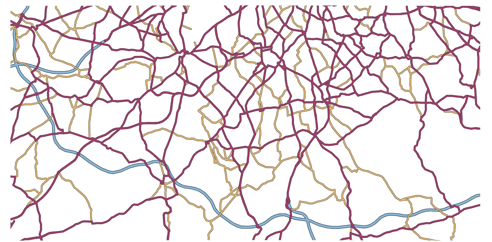

@import "css/litvis.less"

```elm {l=hidden}
import VegaLite exposing (..)
```

# 30 Day Map Challenge, Day 14: Boundaries

_This document best viewed in [litvis](https://github.com/gicentre/litvis)_

## Initial Thoughts

Islands in the stream. Show how major roads act as barriers, not enablers of movement, cutting up communities. Display non road space as 'islands' between large rivers made by major roads. Perhaps use ring-road (inner or outer?) or M25 as main island boundary?

## Data Preparation

1. From open street map, select the London region including the M25. Convert lines to a geoJson file:

```
ogr2ogr -f GeoJSON londonRegionLines.geojson map.osm lines
```

2. In mapshaper, create main road dataset and a bounding box polygon:

```
clip bbox=-0.5705,51.2306,0.14,51.4675
simplify 1%
filter "highway=='motorway' || highway=='trunk' || highway=='primary' || highway=='secondary'"
filter-fields highway
o format=topojson m25SouthRoads.json
rectangle
lines
o format=topojson m25SouthBounds.json
```

Location of generated files:

```elm {l}
path : String -> String
path file =
    "https://gicentre.github.io/data/30dayMapChallenge/" ++ file
```

## Map Design

### Conventional Road Representation

Following Ordnance Survey style colouring for Motorways, A-roads and B-roads.

```elm {l}
mapRoads : Spec
mapRoads =
    let
        w =
            1200

        h =
            w / 2

        colours =
            categoricalDomainMap
                [ ( "motorway", "rgb(124,185,217)" )
                , ( "trunk", "rgb(172,53,108)" )
                , ( "primary", "rgb(172,53,108)" )
                , ( "secondary", "rgb(235,189,105)" )
                ]

        roadData =
            dataFromUrl (path "m25SouthRoads.json") [ topojsonFeature "londonRegionLines" ]

        boundsData =
            dataFromUrl (path "m25SouthBounds.json") [ topojsonFeature "londonRegionLines" ]

        enc =
            encoding
                << color [ mName "properties.highway", mNominal, mScale colours, mLegend [] ]

        lineProps =
            [ maFilled False, maStrokeJoin joRound, maStrokeCap caRound ]

        transMWay =
            transform
                << filter (fiExpr "datum.properties.highway == 'motorway'")

        transARoad =
            transform
                << filter (fiExpr "datum.properties.highway == 'trunk' || datum.properties.highway == 'primary'")

        transBRoad =
            transform
                << filter (fiExpr "datum.properties.highway == 'secondary'")

        mWaySpec1 =
            asSpec [ transMWay [], geoshape (maStrokeWidth 6 :: maStroke "#345" :: lineProps) ]

        mWaySpec2 =
            asSpec [ transMWay [], enc [], geoshape (maStrokeWidth 4 :: maOpacity 1 :: lineProps) ]

        aRoadSpec1 =
            asSpec [ transARoad [], geoshape (maStrokeWidth 4.5 :: maStroke "#534" :: lineProps) ]

        aRoadSpec2 =
            asSpec [ transARoad [], enc [], geoshape (maStrokeWidth 3 :: maOpacity 1 :: lineProps) ]

        bRoadSpec1 =
            asSpec [ transBRoad [], geoshape (maStrokeWidth 4 :: maStroke "#543" :: lineProps) ]

        bRoadSpec2 =
            asSpec [ transBRoad [], enc [], geoshape (maStrokeWidth 2.5 :: maOpacity 1 :: lineProps) ]

        bounds =
            asSpec [ boundsData, geoshape (maStroke "white" :: maStrokeWidth 77 :: lineProps) ]
    in
    toVegaLite
        [ padding (paSize 50)
        , width w
        , height h
        , padding (paSize 20)
        , roadData
        , layer [ mWaySpec1, mWaySpec2, bRoadSpec1, bRoadSpec2, aRoadSpec1, aRoadSpec2, bounds ]
        ]
```



### Island Representation

It would be possible to create island polygons by contouring road buffers within a GIS, but I would like to explore the extent to which it is possible to create island appearance just through overlay of line symbols of different widths and colours. This requires adding a thick outer rectangle in the 'sea' colour to avoid road termini appearing around the edge.

Use a sequence of colours common in island cartography with a light 'beach colour' contrasting with a dark 'cliff' land boundary surrounding a light to dark topographic colouring. Together they can create the illusion of swapping foreground and background structures.

```elm {l v interactive}
mapIslands : Spec
mapIslands =
    let
        w =
            1200

        h =
            w / 2

        seaColour =
            "rgb(142,205,244)"

        beachColour =
            "rgb(214,241,246)"

        cliffColour =
            "rgb(159,150,100)"

        lowElevColour =
            "rgb(197,205,160)"

        peakColour =
            "rgb(170,175,130)"

        cfg =
            configure
                << configuration
                    (coView
                        [ vicoStroke Nothing
                        , vicoBackground [ viewFill (Just peakColour) ]
                        ]
                    )

        roadData =
            dataFromUrl (path "m25SouthRoads.json") [ topojsonFeature "londonRegionLines" ]

        boundsData =
            dataFromUrl (path "m25SouthBounds.json") [ topojsonFeature "londonRegionLines" ]

        lineProps =
            [ maFilled False, maStrokeJoin joRound, maStrokeCap caRound ]

        r1 =
            asSpec [ geoshape (maStroke lowElevColour :: maStrokeWidth 50 :: lineProps) ]

        r2 =
            asSpec [ geoshape (maStroke cliffColour :: maStrokeWidth 22 :: lineProps) ]

        r3 =
            asSpec [ geoshape (maStroke beachColour :: maStrokeWidth 17 :: lineProps) ]

        r4 =
            asSpec [ geoshape (maStroke seaColour :: maStrokeWidth 12 :: lineProps) ]

        bounds =
            asSpec [ boundsData, geoshape (maStroke seaColour :: maStrokeWidth 77 :: lineProps) ]
    in
    toVegaLite
        [ cfg []
        , title "Islands in the Stream"
            [ tiFont "Alfa Slab One"
            , tiFontSize 40
            , tiFontWeight Normal
            , tiColor "#333"
            , tiOffset -80
            , tiSubtitle "\nWe are an island nation, occupying interstices in the service of the motor vehicle."
            , tiSubtitleFontSize 14
            , tiSubtitleFontStyle "italic"
            ]
        , background seaColour
        , padding (paEdges 20 20 20 -40)
        , width w
        , height h
        , roadData
        , layer [ r1, r2, r3, r4, bounds ]
        ]
```


