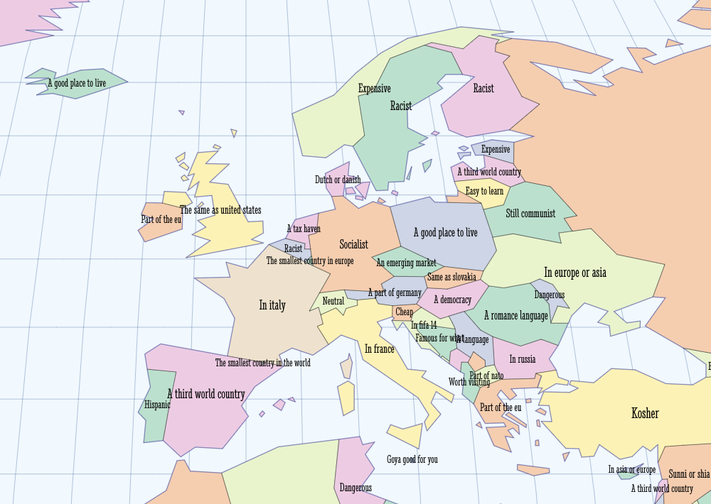
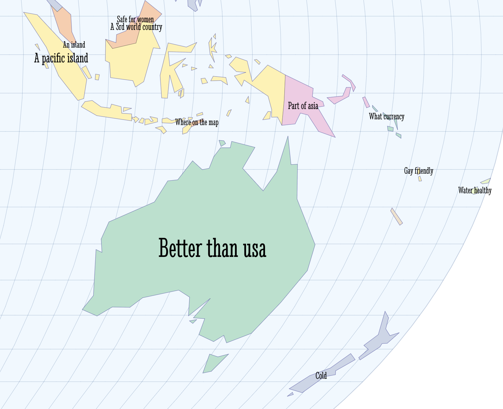
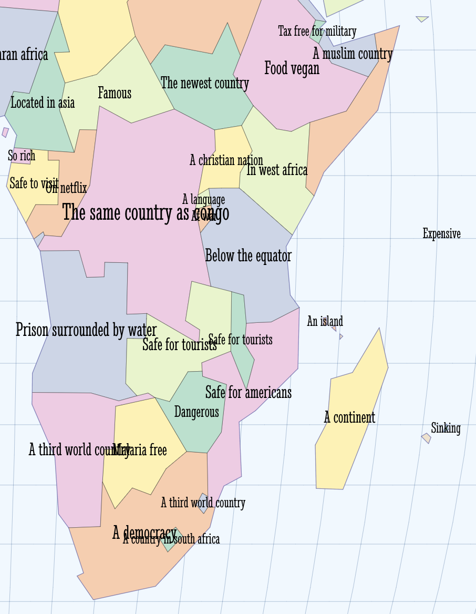

@import "css/litvis.less"

```elm {l=hidden}
import VegaLite exposing (..)
```

# 30 Day Map Challenge, Day 16: Places

_This document best viewed in [litvis](https://github.com/gicentre/litvis)_

## Initial Thoughts

"Place" describes the identities we attach to geographic area. These are subjective and likely to be indistinct, tacit and contradictory. This presents a challenge to representation. Information Retrieval may offer something here, with the search terms people choose to associate with named geographies providing one set of clues about how we choose to think of places.

Could map the results of the autocomplete suggestions following Google queries _"is X..."_ where X is a country name.

## Data Preparation

1. World basemap is '1981' from [project linework](http://www.projectlinework.org) that provides not only a generalised set of boundaries, but various labelling and colouring attributes as a well as a country area measure which can be used for changing font size. Converted into topojson via mapshaper with `o format=topojson world1981.json`.

2. Coastal outline created from `world1981.json` in mapshaper with `dissolve` and `o format=topojson drop-table coastlines1981.json`

3. Label positions generated from `world1981.json` centroids in mapshaper with `each 'longitude=this.x, latitude=this.y' -o 'countryCentroids.csv'`

4. Data on Google autocompletion scraped in 2013 from a now defunct API, but documented in the paper linked to in the[Zeitgeist Borders project](https://zeitgeist-borders.antonomase.fr/?q=is%20New%20Zealand). Autocompletion data stored in `complete.csv`

## Map Design

The stylistic intent here is to create a 'school atlas' but with Google search terms instead of country names. Can use Vega-Lite's built in sphere and graticule generators for the basic globe style. Sizing labels by country size gives a reasonable first attempt at automatic labelling.

```elm {l}
worldPlaces : Spec
worldPlaces =
    let
        w =
            1400

        h =
            w * 53 / 100

        cfg =
            configure
                << configuration (coView [ vicoStroke Nothing ])

        countryData =
            dataFromUrl "data/world1981.json" [ topojsonFeature "countries" ]

        coastlineData =
            dataFromUrl "data/coastlines1981.json" [ topojsonFeature "countries" ]

        placeData =
            dataFromUrl "data/complete.csv" []

        centroidData =
            dataFromUrl "data/countryCentroids.csv" []

        trans =
            transform
                << filter (fiExpr "datum.Area > 0")
                << calculateAs "upper(datum.Best)[0]+slice(datum.Best,1)" "label"
                << lookup "ISO_A3" centroidData "ISO_A3" (luFields [ "longitude", "latitude" ])
                << filter (fiExpr "datum.longitude != null && datum.latitude != null")

        countryEnc =
            encoding
                << color
                    [ mDataCondition [ ( expr "datum.properties.ISO_A3 === 'ATA'", [ mStr "white" ] ) ]
                        [ mName "properties.MAPCOLOR7", mScale [ scScheme "pastel2" [ 0.1 ] ], mNominal, mLegend [] ]
                    ]

        labelEnc =
            encoding
                << position Longitude [ pName "longitude", pQuant ]
                << position Latitude [ pName "latitude", pQuant ]
                << size [ mName "Area", mQuant, mScale [ scRange (raNums [ 3 * w / 800, w / 40 ]) ], mLegend [] ]
                << text [ tName "label", tNominal ]

        proj =
            projection [ prType equalEarth ]

        countrySpec =
            asSpec [ countryData, countryEnc [], geoshape [ maStroke "black", maStrokeWidth 0.2 ] ]

        coastlineSpec =
            asSpec [ coastlineData, geoshape [ maFilled False, maStroke "rgb(100,100,250)", maStrokeWidth 0.8, maOpacity 0.3 ] ]

        labelSpec =
            asSpec [ placeData, trans [], labelEnc [], textMark [ maFont "Stint Ultra Condensed" ] ]

        sphereSpec =
            asSpec [ sphere, geoshape [ maStroke "rgb(190,205,225)", maFill "aliceblue" ] ]

        gratSpec =
            asSpec
                [ graticule [ grStep ( 5, 5 ) ]
                , geoshape
                    [ maFilled False
                    , maStrokeWidth 0.3
                    , maStrokeOpacity 0.7
                    ]
                ]
    in
    toVegaLite
        [ cfg []
        , title "An Atlas of Place Prejudice"
            [ tiFont "Cinzel"
            , tiFontSize (w * 3 / 100)
            , tiOffset (w / -80)
            , tiSubtitle "Most common 2013 Google searches in the form 'Is [country]...'"
            , tiSubtitleFont "Cinzel"
            , tiSubtitleFontSize (13 * w / 800)
            ]
        , width w
        , height h
        , proj
        , layer [ sphereSpec, gratSpec, countrySpec, coastlineSpec, labelSpec ]
        ]
```





