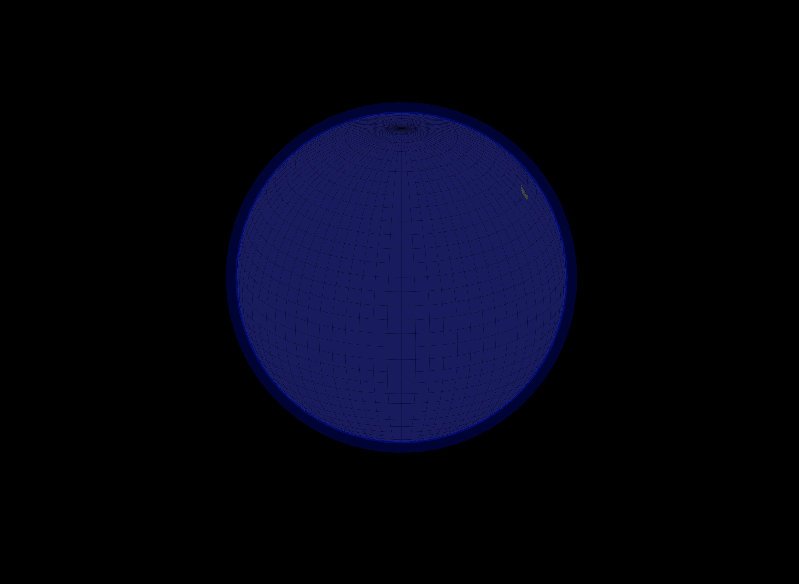

@import "css/litvis.less"

```elm {l=hidden}
import VegaLite exposing (..)
```

# 30 Day Map Challenge, Day 18: Globe

_This document best viewed in [litvis](https://github.com/gicentre/litvis)_

## Initial Thoughts

We've seen a trend in increasing use of the rhetoric of isolationism in several countries recently. Or at least in detachment of near neighbours. The US under Trump and Brexit in the UK being notable in my sphere. What would the globe look like if these countries (and others that flirt with isolationism) really were isolated?

## Data Preparation

1. For US and North Korea examples used [worldCountries.json](https://gicentre.github.io/data/geoTutorials/world-110m.json) for country outlines.

2. For England (as opposed to GB or the UK), used [ukConstituencies.json](https://github.com/gicentre/data/blob/master/uk/ukConstituencies.json). In map shaper filtered for non Scottish and Welsh regions and then dissolving boundaries:

   ```sh
   filter 'eer16nm != "Scotland" && eer16nm != "Wales"'
   dissolve
   o format=topojson england.json
   ```

Location of generated files:

```elm {l}
path : String -> String
path file =
    "https://gicentre.github.io/data/30dayMapChallenge/" ++ file
```

## Map Design

The intent is to create a sense of an isolated country adrift in a large globe. The black background, large border and glowing atmosphere dominated by blue water helps to gain a global perspective.

```elm {l}
globe : Data -> (List LabelledSpec -> ( VLProperty, Spec )) -> Float -> Spec
globe data fTrans lng =
    let
        cfg =
            configure
                << configuration (coView [ vicoStroke Nothing ])

        proj =
            projection [ prType orthographic, prRotate lng -25 0 ]

        sphereSpec1 =
            asSpec [ sphere, geoshape [ maStroke "darkblue", maStrokeWidth 40, maStrokeOpacity 0.4, maFilled False ] ]

        sphereSpec2 =
            asSpec [ sphere, geoshape [ maStroke "blue", maStrokeWidth 5, maStrokeOpacity 0.3, maFill "rgb(25,25,99)" ] ]

        graticuleSpec =
            asSpec
                [ graticule [ grStep ( 5, 5 ) ]
                , geoshape [ maFilled False, maStrokeWidth 0.5, maStrokeOpacity 0.5, maStroke "black" ]
                ]

        countrySpec =
            asSpec [ geoshape [ maFill "rgb(59,74,55)" ] ]
    in
    toVegaLite
        [ cfg []
        , background "black"
        , padding (paSize 400)
        , width 600
        , height 600
        , data
        , fTrans []
        , proj
        , layer [ sphereSpec1, sphereSpec2, countrySpec, graticuleSpec ]
        ]
```

```elm {l v}
usGlobe : Spec
usGlobe =
    globe (dataFromUrl (path "worldCountries.json") [ topojsonFeature "countries1" ])
        (transform << filter (fiExpr "datum.id == 'USA'"))
        30


englandGlobe : Spec
englandGlobe =
    globe (dataFromUrl (path "england.json") [ topojsonFeature "england" ])
        transform
        30


prkGlobe : Spec
prkGlobe =
    globe (dataFromUrl (path "worldCountries.json") [ topojsonFeature "countries1" ])
        (transform << filter (fiExpr "datum.id == 'PRK'"))
        -50
```



