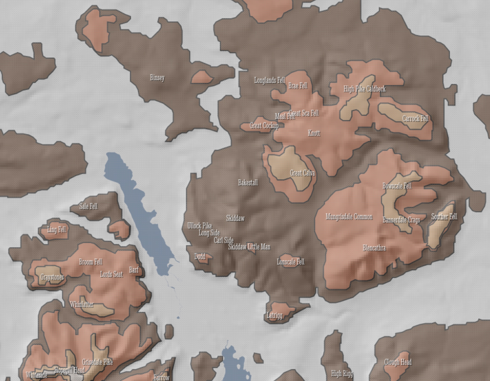
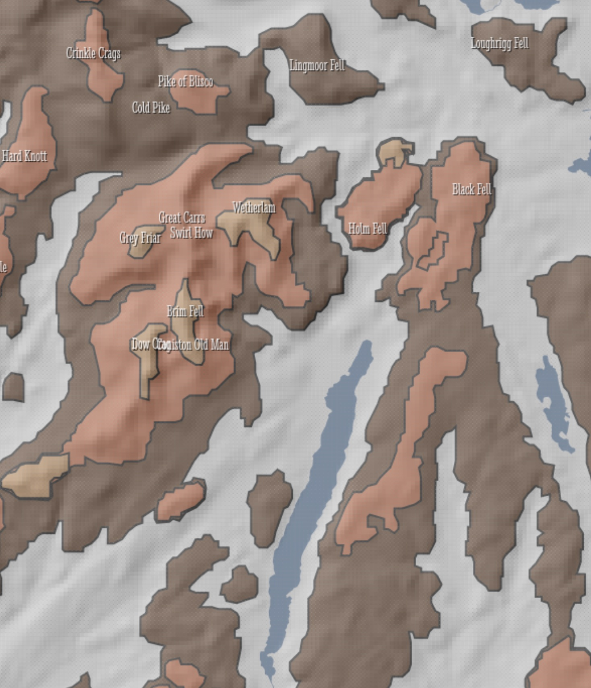
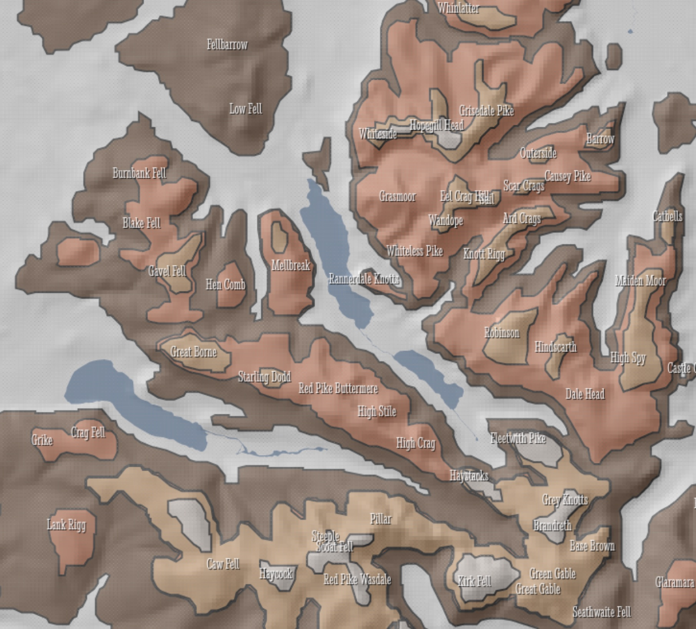

@import "css/litvis.less"

```elm {l=hidden}
import VegaLite exposing (..)
```

# 30 Day Map Challenge, Day 20: Rural

_This document best viewed in [litvis](https://github.com/gicentre/litvis)_

## Initial Thoughts

Rural does not necessarily mean 'pastoral' or 'bucolic'. An opportunity to map upland mountain areas. Would like to explore 'peaks' as regions of interest rather than summit points.

## Data Preparation

1. Digital elevation model available from [Ordnance Survey Terrain 50](https://www.ordnancesurvey.co.uk/opendatadownload/products.html#TERR50), subset from tiles NY and SD. Shaded relief values calculated in [LandSerf](http://www.landserf.org) and exported as point file. Peak contours derived from LandSerf see [Wood 2009](https://staff.city.ac.uk/~jwo/papers/wood_identification_2009.pdf) and converted into topojson files in mapshaper.

2. 'Wainwright' summits digitized manually and saved as `wainwrights.csv`

3. Lake boundaries assembled from [OS Vectormap District](https://www.ordnancesurvey.co.uk/opendatadownload/products.html#VMDVEC). Tiles NY and SD. Shapefiles `SurfaceWater_Area` loaded into mapshaper; merged into single layer; large lakes selected; simplified and saved as topojson:

```
merge-layers target=NY_SurfaceWater_Area,SD_SurfaceWater_Area`

filter 'ID=="1D6236E4-E422-4A31-9817-26BCB74E1D50" || \
 ID=="6C429FAB-C970-4036-8839-DF5DD615F723" || \
 ID=="F141751D-9A95-44E2-9962-FF48B8B8E35C" || \
 ID=="7E6C82DF-2D81-4BCF-B594-3FF7233E247B" || \
 ID=="D911366D-7EB7-43C0-8318-C4735EE64CAA" || \
 ID=="A97A4ABE-B6D5-42EB-AAD6-7382900AEFD2" || \
 ID=="0FE65B84-87FA-4C03-8767-25A8C996BE04" || \
 ID=="118B661E-F7FD-4730-9EBA-7AEC08C295C0" || \
 ID=="89BB4176-7223-472B-8B47-75E3938F5CAC" || \
 ID=="E3E23ED6-EC46-4061-9FA9-66A15F0C01A4" || \
 ID=="CE7413D1-8990-47BA-A1F3-431F0997699A" ||\
 ID=="37B40360-928E-402B-9F1D-3A46BCCF7501"'

simplify 2%
clean
o format=topojson lakes.json
```

4. Coastline selected from [OS Boundary-Line](https://www.ordnancesurvey.co.uk/opendatadownload/products.html#BDLINE). `high_water_polyline.shp` loaded into mapshaper, clipped to Cumbria region, simplified and saved as topojson:

```
clip bbox=293000,483075,359875,545325
$ simplify 50%
$ o format=topojson cumbriaCoast.json
```

## Map Design

The intention is to show the distribution of nested peak areas (smaller peaks sitting on top of larger ones) combined with a shaded relief map of the Cumbria region. Vega-Lite is not optimised for raster processing, but symbolising each raster cell with a square, coloured by relief shading value works well enough. Making the relief symbols transparent and placing them over the peak polygons provides a combined shaded polygon effect.

Lakes, fell names and coastline provide contextual information.

```elm {l}
reliefMap : Spec
reliefMap =
    let
        w =
            1400

        h =
            w * 313 / 346

        cfg =
            configure
                << configuration (coView [ vicoStroke Nothing ])

        -- Data sources
        dataRelief =
            dataFromUrl "data/cumbriaRelief.csv" []

        peakData1 =
            dataFromUrl "data/peakContours1.json" [ topojsonFeature "peakContours" ]

        peakData2 =
            dataFromUrl "data/peakContours2.json" [ topojsonFeature "peakContours" ]

        peakData3 =
            dataFromUrl "data/peakContours3.json" [ topojsonFeature "peakContours" ]

        peakData4 =
            dataFromUrl "data/peakContours4.json" [ topojsonFeature "peakContours" ]

        lakesData =
            dataFromUrl "data/lakes.json" [ topojsonFeature "lakes" ]

        summitData =
            dataFromUrl "data/wainwrights.csv" [ parse [ ( "easting", foNum ), ( "northing", foNum ) ] ]

        coastData =
            dataFromUrl "data/cumbriaCoast.json" [ topojsonFeature "high_water_polyline" ]

        -- Transformations
        proj =
            projection [ prType identityProjection, prReflectY True ]

        labelTrans =
            transform
                << calculateAs "datum.easting - 25" "easting2"
                << calculateAs "datum.northing + 25" "northing2"

        -- layers
        encRelief =
            encoding
                << position X [ pName "easting", pQuant, pScale [ scDomain (doNums [ 292800, 361000 ]), scZero False, scNice niFalse ], pAxis [] ]
                << position Y [ pName "northing", pQuant, pScale [ scZero False, scNice niFalse ], pAxis [] ]
                << color [ mName "relief", mQuant, mScale [ scRange (raStrs [ "black", "white" ]) ], mLegend [] ]

        specRelief =
            asSpec [ dataRelief, encRelief [], square [ maSize 4.4, maOpacity 0.6 ] ]

        peakSpec1 =
            asSpec [ peakData1, geoshape [ maFill "rgb(104,56,25)", maFillOpacity 1, maStroke "black" ] ]

        peakSpec2 =
            asSpec [ peakData2, geoshape [ maFill "rgb(235,107,59)", maFillOpacity 1, maStroke "black" ] ]

        peakSpec3 =
            asSpec [ peakData3, geoshape [ maFill "rgb(238,162,96)", maFillOpacity 1, maStroke "black" ] ]

        peakSpec4 =
            asSpec [ peakData4, geoshape [ maFill "rgb(246,227,216)", maFillOpacity 1, maStroke "black" ] ]

        peakSpec =
            asSpec [ proj, layer [ peakSpec1, peakSpec2, peakSpec3, peakSpec4 ] ]

        lakesSpec =
            asSpec [ lakesData, proj, geoshape [] ]

        coastSpec =
            asSpec
                [ coastData
                , proj
                , geoshape
                    [ maFilled False
                    , maStrokeWidth 12
                    , maStroke "rgb(198,198,198)"
                    , maStrokeJoin joRound
                    , maOpacity 1
                    ]
                ]

        coastSpec2 =
            asSpec
                [ coastData
                , proj
                , geoshape
                    [ maFilled False
                    , maStrokeWidth 2
                    , maStroke "rgb(125,140,157)"
                    , maStrokeJoin joRound
                    , maOpacity 0.7
                    ]
                ]

        encSummit =
            encoding
                << position X [ pName "easting", pQuant, pScale [ scDomain (doNums [ 292800, 361000 ]), scZero False, scNice niFalse ], pAxis [] ]
                << position Y [ pName "northing", pQuant, pScale [ scZero False, scNice niFalse ], pAxis [] ]
                << text [ tName "name", tNominal ]

        specSummit1 =
            asSpec
                [ summitData
                , encSummit []
                , textMark [ maFont "Stint Ultra Condensed", maColor "black", maOpacity 0.7, maFontSize 8 ]
                ]

        encSummit2 =
            encoding
                << position X [ pName "easting2", pQuant, pScale [ scDomain (doNums [ 292800, 361000 ]), scZero False, scNice niFalse ], pAxis [] ]
                << position Y [ pName "northing2", pQuant, pScale [ scZero False, scNice niFalse ], pAxis [] ]
                << text [ tName "name", tNominal ]

        specSummit2 =
            asSpec
                [ summitData
                , labelTrans []
                , encSummit2 []
                , textMark [ maFont "Stint Ultra Condensed", maColor "white", maOpacity 0.9, maFontSize 8 ]
                ]
    in
    toVegaLite
        [ cfg []
        , width w
        , height h
        , title "Cumbrian Fells"
            [ tiFont "Fjalla One"
            , tiFontSize 52
            , tiOrient siBottom
            , tiAnchor anStart
            , tiOffset -100
            , tiSubtitle "Peak hierarchy of at leat 50m relative drop\nAll 'Wainwright' summits named."
            , tiSubtitleFontSize 16
            ]
        , layer [ lakesSpec, peakSpec, specRelief, specSummit1, specSummit2, coastSpec, coastSpec2 ]
        ]
```





