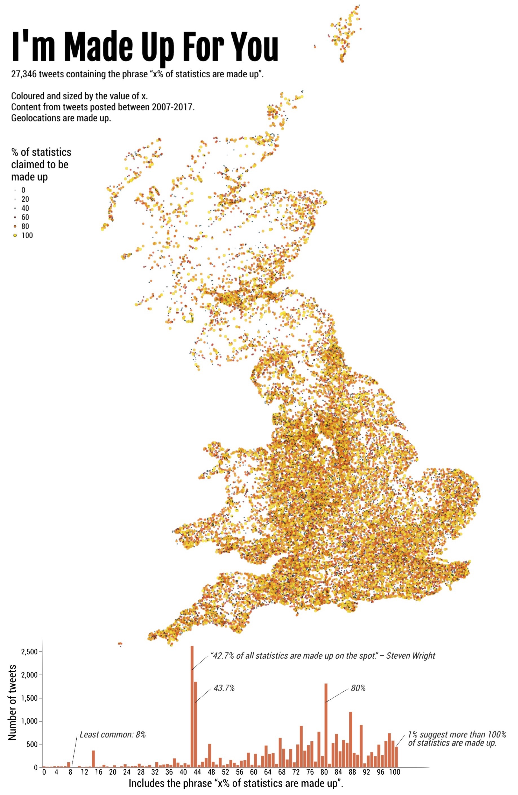

@import "css/litvis.less"

```elm {l=hidden}
import VegaLite exposing (..)
```

# 30 Day Map Challenge, Day 24: Statistics

_This document best viewed in [litvis](https://github.com/gicentre/litvis)_

## Initial Thoughts

Twitter wags like to suggest that _x% of statistics are made up_. This joke is often repeated, but with different values for _x_. But which are more common, and where? I have collected tweets featuring variations of this joke over a ten year period (27,346 tweets). Show the results in map and histogram form.

I don't have the georeferences of the tweets, so will need to make these up (i.e. 50% of the submission will be made up (geo) and 50% genuine (frequencies)). Could use other georeferenced tweets as a proxy or some other measure of population location.

## Data Preparation

1. x% of statistics are made up tweets collected between 2007 and 2017 and filtered with regular expression

```
".+(%|[P|p]ercent).+[S|s]tatistics.+[M|m]ade up.+"
```

2. Geolocations taken from [OS OpenNames](https://www.ordnancesurvey.co.uk/opendatadownload/products.html#OPNAME) and combined and filtered into a TSV file of populated places:

```
cat *.csv >combined.csv
grep  "populatedPlace" combined.csv >popNames.csv
ruby -rcsv -e 'CSV.foreach(ARGV.shift) {|row| print row[2],"\t",row[8],"\t",row[9],"\n"}' popNames.csv >gbPopNames.tsv`
```

3. Made up geolocations generated by randomly sampling 27346 locations from `gbPopNames.tsv` and combining with the _x%_ value from each of the tweets, where _x_ is extracted with the regular expression:

```
(\\d+(?:\\.\\d+)?)\\s*(%|[P|p]ercent)
```

Location of generated files:

```elm {l}
path : String -> String
path file =
    "https://gicentre.github.io/data/30dayMapChallenge/" ++ file
```

## Map Design

The data collected are not georeferenced, which makes challenge for mapping. Randomly attaching each x% to a location associated with a place name in GB gives something a distribution that is credible, even if disproportionately weighted towards rural place names.

Need to combine the mapped data with the frequency distribution (which is the interesting and non-made-up part of the data).

```elm {l v interactive}
map : Spec
map =
    let
        w =
            720

        h =
            1000

        cfg =
            configure
                << configuration (coView [ vicoStroke Nothing ])
                << configuration
                    (coLegend
                        [ lecoTitleFont "Roboto Condensed"
                        , lecoTitleFont "Roboto Condensed"
                        , lecoTitleFontWeight Normal
                        , lecoTitleFontSize 17
                        , lecoLabelFont "Roboto Condensed"
                        , lecoLabelFontSize 12
                        ]
                    )

        data =
            dataFromUrl (path "madeUp.csv") []

        enc =
            encoding
                << position X
                    [ pName "easting"
                    , pQuant
                    , pScale
                        [ scDomain (doNums [ -80000, 650000 ])
                        , scNice niFalse
                        ]
                    , pAxis []
                    ]
                << position Y [ pName "northing", pQuant, pScale [ scNice niFalse ], pAxis [] ]
                << color [ mName "percent", mQuant, mScale [ scScheme "darkRed" [ -0.95, 1 ] ] ]
                << size
                    [ mName "percent"
                    , mQuant
                    , mScale [ scRange (raNums [ 1, 20 ]), scType scPow, scExponent 3 ]
                    , mLegend
                        [ leTitle "% of statistics\nclaimed to be\nmade up"
                        , leOrient loNone
                        , leX 0
                        , leY 220
                        , leSymbolStrokeColor "black"
                        , leSymbolStrokeWidth 0.5
                        ]
                    ]
    in
    toVegaLite
        [ cfg []
        , width w
        , height h
        , title "I'm Made Up For You"
            [ tiFontSize 52
            , tiOffset -185
            , tiFont "Fjalla One"
            , tiAnchor anStart
            , tiSubtitle """27,346 tweets containing the phrase “x% of statistics are made up”.

Coloured and sized by the value of x.
Content from tweets posted between 2007-2017.
Geolocations are made up."""
            , tiSubtitleFont "Roboto Condensed"
            , tiSubtitleFontSize 15
            ]
        , data
        , enc []
        , circle [ maOpacity 0.8, maStrokeWidth 0.5, maStroke "black", maStrokeOpacity 0.1 ]
        ]
```

```elm {l v}
freq : Spec
freq =
    let
        cfg =
            configure
                << configuration (coView [ vicoStroke Nothing ])
                << configuration
                    (coAxis
                        [ axcoTitleFont "Roboto Condensed"
                        , axcoTitleFontWeight Normal
                        , axcoTitleFontSize 17
                        , axcoLabelFont "Roboto Condensed"
                        , axcoLabelFontSize 12
                        , axcoGrid False
                        ]
                    )

        freqData =
            dataFromUrl (path "madeUp.csv") []

        annotationData =
            dataFromColumns []
                << dataColumn "x" (nums [ 8.5, 42.5, 43.5, 80.5, 100.5, 103.2 ])
                << dataColumn "y" (nums [ 20, 2100, 1400, 1400, 450, 520 ])
                << dataColumn "x2" (nums [ 10, 47, 48, 87, 103, 103.2 ])
                << dataColumn "y2" (nums [ 700, 2400, 1700, 1700, 700, 520 ])
                << dataColumn "txt"
                    (strs
                        [ "Least common: 8%"
                        , "“42.7% of all statistics are made up on the spot” – Steven Wright"
                        , "43.7%"
                        , "80%"
                        , "1% suggest more than 100% "
                        , "of statistics are made up."
                        ]
                    )

        encBar =
            encoding
                << position X
                    [ pName "percent"
                    , pQuant
                    , pBin [ biStep 1, biExtent 0 101 ]
                    , pAxis [ axTicks False, axTitle "Includes the phrase “x% of statistics are made up”." ]
                    ]
                << position Y
                    [ pQuant
                    , pAggregate opCount
                    , pAxis [ axTitle "Number of tweets" ]
                    ]

        specBar =
            asSpec [ freqData, encBar [], bar [ maColor "rgb(210,109,73)" ] ]

        encLeaders =
            encoding
                << position X [ pName "x", pQuant ]
                << position X2 [ pName "x2" ]
                << position Y [ pName "y", pQuant ]
                << position Y2 [ pName "y2" ]

        specLeaders =
            asSpec [ annotationData [], encLeaders [], rule [ maStrokeWidth 0.5 ] ]

        encAnnotation =
            encoding
                << position X [ pName "x2", pQuant ]
                << position Y [ pName "y2", pQuant ]
                << text [ tName "txt", tNominal ]

        specAnnotation =
            asSpec
                [ annotationData []
                , encAnnotation []
                , textMark
                    [ maAlign haLeft
                    , maDx 3
                    , maFont "Roboto Condensed"
                    , maFontStyle "italic"
                    , maFontSize 14
                    , maOpacity 0.8
                    ]
                ]
    in
    toVegaLite
        [ cfg []
        , width 600
        , layer [ specBar, specLeaders, specAnnotation ]
        ]
```


