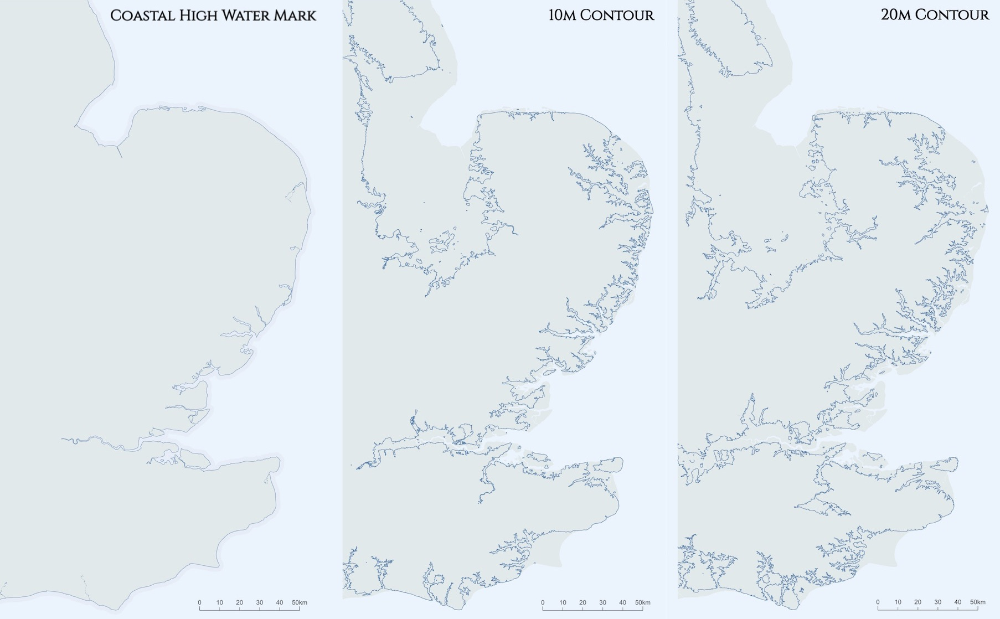

@import "css/litvis.less"

```elm {l=hidden}
import VegaLite exposing (..)
```

# 30 Day Map Challenge, Day 25: Climate

_This document best viewed in [litvis](https://github.com/gicentre/litvis)_

## Initial Thoughts

Would like to show ocean currents as a vector grid, but finding open data at a scale suitable for showing global currents was challenging.

Alternatively, could look at effect of sea level rise on vulnerable coastlines.

## Data Preparation

1.  UK Coastline extracted from [Ordnance Survey Boundary-Line dataset](https://www.ordnancesurvey.co.uk/opendatadownload/products.html#BDLINE) `high_water_polyline` and then clipped to East coast region and converted to polygon in mapshaper:

    ```sh
    clip bbox= 500000,95150,655650,400000
    polygons
    o format=topojson eastCoastPoly.json
    ```

2.  Contour lines extracted from [Ordnance Survey terrain 50 vector contour dataset](https://www.ordnancesurvey.co.uk/opendatadownload/products.html#TERR50). Tiles TF,TG,TL,TM,TQ,TR,TV combined using mapshaper's `merge-layers`. 10m and 20m contours extracted in mapshaper with `filter 'PROP_VALUE <= 20'`

Location of generated files:

```elm {l}
path : String -> String
path file =
    "https://gicentre.github.io/data/30dayMapChallenge/" ++ file
```

## Map Design

Triptych of current, 10m and 20m coastlines. Ideally would represent the 10m and 20m contour lines as polygons to give stronger emphasis on new land area, but closing contours in clipped area is challenging.

```elm {l=hidden}
w =
    540


h =
    1.96 * w


cfg =
    configure
        << configuration (coView [ vicoStroke Nothing ])


landColour =
    "rgb(226,233,234)"


seaColour =
    "rgb(236,244,253)"


shallowColour =
    "rgb(230,237,247)"


landData =
    dataFromUrl (path "eastCoastPoly.json") [ topojsonFeature "land" ]


contourData =
    dataFromUrl (path "eastCoastContours.json") [ topojsonFeature "eastCoast" ]


proj =
    projection
        [ prType identityProjection, prReflectY True ]


landSpec : Spec
landSpec =
    asSpec [ landData, geoshape [ maFill landColour ] ]


scaleSpec : Spec
scaleSpec =
    let
        scaleData =
            dataFromJson
                (geometry
                    (geoLines
                        [ [ ( 600000, 95000 ), ( 650000, 95000 ) ]
                        , [ ( 600000, 95000 ), ( 600000, 97000 ) ]
                        , [ ( 610000, 95000 ), ( 610000, 96500 ) ]
                        , [ ( 620000, 95000 ), ( 620000, 96500 ) ]
                        , [ ( 630000, 95000 ), ( 630000, 96500 ) ]
                        , [ ( 640000, 95000 ), ( 640000, 96500 ) ]
                        , [ ( 650000, 95000 ), ( 650000, 97000 ) ]
                        ]
                    )
                    []
                )
                []

        scaleLabelData =
            dataFromColumns []
                << dataColumn "easting" (nums [ 600000, 610000, 620000, 630000, 640000, 650000 ])
                << dataColumn "northing" (nums [ 97500, 97500, 97500, 97500, 97500, 97500 ])
                << dataColumn "label" (strs [ "0", "10", "20", "30", "40", "50km" ])

        enc =
            encoding
                << position X
                    [ pName "easting"
                    , pQuant
                    , pScale [ scDomain (doNums [ 500000, 655617 ]), scNice niFalse, scZero False ]
                    , pAxis []
                    ]
                << position Y
                    [ pName "northing"
                    , pQuant
                    , pScale [ scDomain (doNums [ 95151, 400000 ]), scNice niFalse, scZero False ]
                    , pAxis []
                    ]
                << text [ tName "label" ]

        scalebarSpec =
            asSpec [ scaleData, geoshape [ maFilled False, maStroke "black", maStrokeWidth 0.5 ] ]

        scaleLabelSpec =
            asSpec [ scaleLabelData [], enc [], textMark [ maBaseline vaBottom, maOpacity 0.7 ] ]
    in
    asSpec [ layer [ scalebarSpec, scaleLabelSpec ] ]
```

```elm {l v}
lwmMap : Spec
lwmMap =
    let
        maskData =
            dataFromJson
                (geometry
                    (geoPolygon
                        [ [ ( 500000, 400000 )
                          , ( 543918, 400000 )
                          , ( 500000, 200000 )
                          , ( 500000, 100600 )
                          , ( 500000, 400000 )
                          ]
                        ]
                    )
                    []
                )
                []

        coastSpec =
            asSpec
                [ landData
                , layer
                    [ asSpec [ geoshape [ maFilled False, maStrokeWidth 16, maStrokeJoin joRound, maStroke shallowColour ] ]
                    , asSpec [ geoshape [ maFilled False, maStrokeWidth 1 ] ]
                    , asSpec [ maskData, geoshape [ maFill landColour, maStroke landColour, maStrokeWidth 2 ] ]
                    ]
                ]
    in
    toVegaLite
        [ width w
        , height h
        , cfg []
        , padding (paEdges 20 10 20 0)
        , title "Coastal High Water Mark" [ tiFont "Cinzel", tiFontSize 26, tiAnchor anEnd, tiOffset -52 ]
        , background seaColour
        , proj
        , layer [ coastSpec, landSpec, scaleSpec ]
        ]
```

```elm {l v}
contour10Map : Spec
contour10Map =
    let
        trans =
            transform << filter (fiExpr "datum.properties.PROP_VALUE == 10")

        contourSpec =
            asSpec [ contourData, trans [], geoshape [ maFilled False, maStrokeWidth 0.7 ] ]
    in
    toVegaLite
        [ width w
        , height h
        , cfg []
        , padding (paSize 21)
        , title "10m Contour" [ tiFont "Cinzel", tiFontSize 26, tiAnchor anEnd, tiOffset -40 ]
        , background seaColour
        , proj
        , layer [ landSpec, contourSpec, scaleSpec ]
        ]
```

```elm {l v interactive}
contour20Map : Spec
contour20Map =
    let
        trans =
            transform << filter (fiExpr "datum.properties.PROP_VALUE == 20")

        contourSpec =
            asSpec [ contourData, trans [], geoshape [ maFilled False, maStrokeWidth 0.7 ] ]
    in
    toVegaLite
        [ width w
        , height h
        , cfg []
        , padding (paSize 21)
        , title "20m Contour" [ tiFont "Cinzel", tiFontSize 26, tiAnchor anEnd, tiOffset -40 ]
        , background seaColour
        , proj
        , layer [ landSpec, contourSpec, scaleSpec ]
        ]
```


