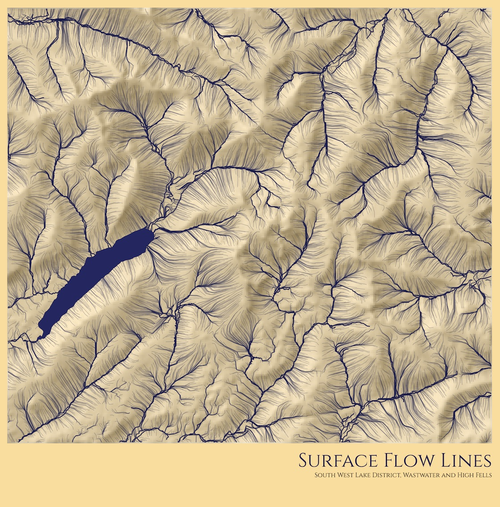

@import "css/litvis.less"

```elm {l=hidden}
import VegaLite exposing (..)
```

# 30 Day Map Challenge, Day 26: Hydrology

_This document best viewed in [litvis](https://github.com/gicentre/litvis)_

## Initial Thoughts

Could do some topological analysis of stream networks. Perhaps represent them schematically? Would be good practice for [Advent Of Code](https://adventOfCode.com) in December.

Could show flow accumulation lines generated from LandSerf. Can produce pleasing cartographic output.

## Data Preparation

1.  Flow lines generated in [LandSerf](http://www.landserf.org) from OS50 Terrain DEM of SD and NY tiles:

    - clip to SW Lakes District region - (312875,500025) to (329325,514825)
    - pit removal with channelling
    - flow accumulation with vectors selected, minimum flow magnitude of 2, 70% sample
    - saved as shapefile

2.  Major streamlines imported from Ordnance Survey [OpenRivers dataset](https://www.ordnancesurvey.co.uk/opendatadownload/products.html), clipped in mapshaper and saved as topoJSON:

    ```sh
    clip bbox=313545,500650,328710,514250
    o format=topojson swLakeDistrictStreams.json
    ```

3.  Relief shading generated in LandSerf using same clipped DEM as step 1. Saved as point file. Add `easting,northing,relief` header to file and replace tabs with commas to created `swLakeDistrictRelief.csv`.

4.  Import flow vector shapefile into mapshaper, simplify and clip to slightly smaller region to remove edge effects:

    ```sh
    clip bbox=313545,500650,328710,514250
    simplify 98%
    clean
    o format=topojson swLakeDistrictFlows.json
    ```

5.  Wastwater lake boundary extracted from [OS Vectormap District](https://www.ordnancesurvey.co.uk/opendatadownload/products.html#VMDVEC), tile NY. Shapefiles `SurfaceWater_Area` loaded into mapshaper, filtered, clipped and saved as topojson:

    ```sh
    filter ID=='37B40360-928E-402B-9F1D-3A46BCCF7501'
    clean
    clip bbox=313545,500650,328710,514250
    o format=topojson lakes.json
    ```

Location of generated files:

```elm {l}
path : String -> String
path file =
    "https://gicentre.github.io/data/30dayMapChallenge/" ++ file
```

## Map Design

Show flow lines against a shaded relief map of terrain. Keep shaded relief somewhat subdued to enhance contrast with flow lines. Using transparency for lines helps to show difference between upper and lower accumulations along their length. Flat regions are a problem for the flow accumulation algorithm, so overlay lake features (in this case, just Wastwater).

```elm {l v interactive}
flowMap : Spec
flowMap =
    let
        w =
            1200

        h =
            w * 273 / 304

        waterColour =
            "rgb(24,25,75)"

        lakeColour =
            "rgb(36,37,100)"

        flowData =
            dataFromUrl (path "swLakeDistrictFlows.json") [ topojsonFeature "flows" ]

        streamData =
            dataFromUrl (path "swLakeDistrictStreams.json") [ topojsonFeature "WatercourseLink" ]

        reliefData =
            dataFromUrl (path "swLakeDistrictRelief.csv") []

        lakesData =
            dataFromUrl (path "wastwater.json") [ topojsonFeature "NY_SurfaceWater_Area" ]

        proj =
            projection
                [ prType identityProjection, prReflectY True ]

        flowSpec =
            asSpec
                [ flowData
                , proj
                , geoshape [ maFilled False, maStroke waterColour, maOpacity 0.3 ]
                ]

        streamSpec =
            asSpec
                [ streamData
                , proj
                , geoshape [ maFilled False, maStroke waterColour, maStrokeWidth 2, maOpacity 1 ]
                ]

        encRaster =
            encoding
                << position X
                    [ pName "easting"
                    , pQuant
                    , pScale [ scZero False, scNice niFalse ]
                    , pAxis []
                    ]
                << position Y
                    [ pName "northing"
                    , pQuant
                    , pScale [ scZero False, scNice niFalse ]
                    , pAxis []
                    ]

        encRelief =
            encRaster
                << color
                    [ mName "relief"
                    , mQuant
                    , mScale [ scRange (raStrs [ "black", "white" ]) ]
                    , mLegend []
                    ]

        reliefSpec =
            asSpec
                [ reliefData
                , encRelief []
                , square [ maSize (w / 75), maOpacity 0.4 ]
                ]

        lakesSpec =
            asSpec
                [ lakesData
                , proj
                , geoshape [ maFill lakeColour, maStroke waterColour ]
                ]
    in
    toVegaLite
        [ width w
        , height h
        , background "rgb(255,220,150)"
        , padding (paEdges 20 20 20 100)
        , title "Surface Flow Lines"
            [ tiFontSize 48
            , tiFont "Cinzel"
            , tiFontWeight fwNormal
            , tiColor waterColour
            , tiOrient siBottom
            , tiOffset 20
            , tiAnchor anEnd
            , tiSubtitle "South West Lake District, Wastwater and High Fells"
            , tiSubtitleFont "Cinzel"
            , tiSubtitleFontSize 16
            ]
        , layer [ reliefSpec, streamSpec, flowSpec, lakesSpec ]
        ]
```


