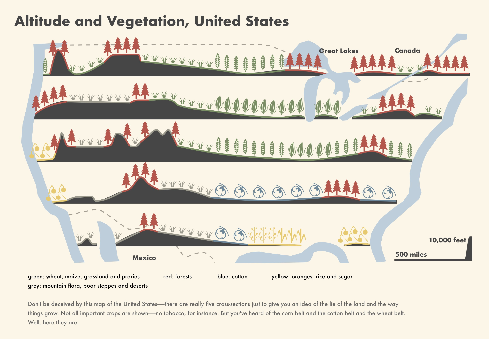

@import "css/litvis.less"

```elm {l=hidden}
import VegaLite exposing (..)
```

# 30 Day Map Challenge, Day 27: Resources

_This document best viewed in [litvis](https://github.com/gicentre/litvis)_

## Initial Thoughts

Would like to reproduce an [ISOTYPE](http://www.thomwhite.co.uk/?p=1303) map/diagram, as resource production was often a theme in these early 20th century designs.
Map of [Altitude and Vegetation across the United States](http://www.thomwhite.co.uk/wp-content/uploads/2013/05/isotype_p11_only_an_ocean_between_l_s_florence.jpg) provides a nice example of the genre.

## Data Preparation

1. Profiles digitized with [LandSerf](http://www.landserf.org) from a scan of [the original](http://www.thomwhite.co.uk/wp-content/uploads/2013/05/isotype_p11_only_an_ocean_between_l_s_florence.jpg).

2. Vegetation and crop symbols created in [this SVG editor](https://jxnblk.github.io/paths).

## Map Design

```elm {l}
isotype : Spec
isotype =
    let
        cfg =
            configure
                << configuration (coView [ vicoStroke Nothing ])

        profileData =
            dataFromUrl "data/isotypeProfiles.csv" [ parse [ ( "x", foNum ), ( "y", foNum ), ( "y2", foNum ) ] ]

        pointsData =
            dataFromUrl "data/isotypePoints.csv" [ parse [ ( "x", foNum ), ( "y", foNum ) ] ]

        coastData =
            dataFromUrl "data/isotypeCoast.json" [ topojsonFeature "isotypeCoast" ]

        bordersData =
            dataFromUrl "data/isotypeBorders.json" [ topojsonFeature "isotypeBorders" ]

        labelsData =
            dataFromUrl "data/isotypeLabels.csv" [ parse [ ( "x", foNum ), ( "y", foNum ) ] ]

        colours =
            categoricalDomainMap
                [ ( "blue", "rgb(103,137,157)" )
                , ( "green", "rgb(115,144,94)" )
                , ( "grey", "rgb(156,153,139)" )
                , ( "red", "rgb(194,79,70)" )
                , ( "yellow", "rgb(237,201,96)" )
                ]

        shapes =
            categoricalDomainMap
                [ ( "forest", forest )
                , ( "grass", grass )
                , ( "oranges", oranges )
                , ( "sugar", sugar )
                , ( "rice", rice )
                , ( "wheat", wheat )
                , ( "maize", maize )
                , ( "cotton", cotton )
                ]

        forest =
            "M8 -38 C4 -42 4 -42 0 -48 C-4 -42 -4 -42 -8 -38 L-4 -40 C-6 -34 -6 -34 -10 -28 L-6 -30 C-8 -24 -8 -24 -12 -18 L-8 -20 C-10 -14 -10 -14 -14 -8 L-2 -12 L-2 0 L2 0 L2 -12 L14 -8 C10 -14 10 -14 8 -20 L12 -18 C8 -24 8 -24 6 -30 L10 -28 C6 -34 6 -34 4 -40 Z"

        grass =
            "M4 0 C4 -4 6 -10 12 -16 C8 -14 6 -12 4 -6 C4 -12 4 -14 8 -20 C4 -16 2 -16 0 0 M-8 -20 C-4 -16 -2 -16 0 0 L-4 0 C-4 -4 -6 -8 -12 -16 C-8 -12 -6 -10 -4 -6 C-4 -12 -4 -14 -8 -20 Z"

        oranges =
            "M-20 -26 L-18 -20 C-22 -18 -24 -20 -22 -8 C-26 -8 -28 -6 -28 -2 C-28 2 -24 4 -20 4 C-16 4 -14 2 -14 -2 C-14 -2 -14 -8 -20 -8 C-20 -12 -24 -18 -16 -18 L2 4 L2 0 C-6 -10 -26 -20 -12 -38 C-8 -38 -6 -38 -6 -32 C-10 -32 -12 -30 -12 -24 C-12 -20 -10 -18 -4 -18 C0 -18 2 -22 2 -26 C2 -30 -2 -32 -4 -32 C-4 -36 -4 -38 -10 -40 L-8 -42 L-12 -42 Z"

        sugar =
            "M0 0 L4 0 L4 -4 L12 -22 L18 -6 C16 -24 12 -42 4 -10 L4 -44 L0 -44 L0 -28 C-6 -44 -6 -46 -12 -16 L-6 -34 L0 -20 Z"

        rice =
            "M0 0 L2 0 L2 -8 C4 -16 10 -16 8 -20 C4 -18 4 -18 4 -14 L2 -10 L2 -22 C6 -26 12 -24 8 -32 C2 -30 6 -28 2 -24 L2 -42 C5 -43 2 -46 6 -48 C8 -44 6 -42 2 -42 L2 -48 L0 -48 L0 -38 C-8 -40 -2 -44 -8 -46 C-12 -40 -2 -38 0 -38 L0 -8 C-4 -8 -14 -12 -4 -16 C-2 -18 -4 -20 -6 -22 C-8 -16 -4 -16 -8 -16 L-10 -22 C-12 -28 -8 -30 -8 -32 C-10 -34 -14 -30 -12 -28 L-14 -28 C-18 -28 -16 -32 -18 -32 C-16 -32 -22 -30 -16 -28 L-12 -26 L-10 -16 C-13 -18 -12 -22 -16 -20 C-15 -19 -14 -16 -12 -18 L-10 -14 C-10 -14 -12 -10 0 -6 Z"

        wheat =
            "M-0.4 0.7 L-0.4 -3 L2 -3 L2 0.7 M-4 -10 C-6 -12 -8 -17 -0.4 -12 L0.5 -8 M0.5 -13 L-0.4 -17 C-0.4 -19 -9 -25 -5 -16 M0.5 -19 L-0.4 -25 C-5 -27 -8 -27 -5 -22 M-0.7 -26 L-0.4 -31 C-4 -31 -8 -31 -5 -28 M-0.4 -32 L0.3 -37 C-4 -39 -6 -37 -4 -32 M1 -3 C4 -5 8 -5 6 -9 L2 -8 L1 -7 M1 -8 L0.7 -12 C4 -14 9 -17 6 -10 M2 -14 L1 -18 C4 -20 10 -23 6 -16 M1.4 -19.5 L0.6 -25 C1.6 -25 10 -31 6 -22 M0.5 -26 L0.8 -31 C4 -31 9 -36 6 -28 M0.8 -32 L1.6 -37 C5 -39 8 -37 6 -34 M0.7 -38 L-3 -39 C0.8 -45 0.7 -47 5 -39 M-0.09 -7 L0.3 -2 C-2 -5 -6 -4 -5 -8 Z"

        maize =
            "M-0.4 0.9 L-0.4 -3.1 C19 -12 7.8 -15 16 -26 10 -15 20 -11 2 -3 L2 1 M4 -6 C10 -14 12 -26 7 -46 C8 -32 7 -18 2 -4 M2 -4 C4 -17 6 -24 7 -46 C4 -39 -4 -35 -0.36 -3. M1.5 -4 C-11 -10 -4 -30 -12 -31 C-7 -28 -9 -8 -0.4 -3 M-1 -6 C-4 -20 -3 -32 6 -45 C-6 -34 -9 -21 -2 -7 Z"

        cotton =
            "M4 -0.9 L-2 0 C16 0 26 -10 10 -28 L10 -28 L12 -30 C16 -28 21 -23 25 -9 L26 -12 C18 -32 16 -32 0 -40 L-4 -40 C-2 -38 2 -38 10 -32 L8 -30 C-4 -44 -30 -14 -2 0 M-8 -27 C-10 -22 -10 -18 -2 -16 C-4 -14 -12 -14 -11 -23 M0.1 -2 C4 -5 5 -4 5 -10 C6 -8 10 -6 4 -2 M-2 -24 C0 -22 4 -22 6 -24 C6 -20 6 -20 8 -14 C10 -17 12 -16 12 -20 C14 -18 20 -10 10 -4 C4 -2 -6 2 -12 -14 C-14 -26 0 -38 6 -28 C4 -28 2 -28 -2 -24 Z"

        proj =
            projection [ prType identityProjection, prReflectY True ]

        coastSpec =
            asSpec [ coastData, proj, geoshape [ maColor "rgb(186,206,221)", maOpacity 1 ] ]

        bordersSpec =
            asSpec
                [ bordersData
                , proj
                , geoshape
                    [ maFilled False
                    , maStrokeWidth 2
                    , maStrokeDash [ 8, 8 ]
                    , maStroke "rgb(166,159,147)"
                    ]
                ]

        profileBodyEnc =
            encoding
                << position X
                    [ pName "x"
                    , pScale [ scDomain (doNums [ 0, 3400 ]), scNice niFalse ]
                    , pQuant
                    , pAxis []
                    ]
                << position Y
                    [ pName "y"
                    , pScale [ scDomain (doNums [ 0, 1735 ]), scNice niFalse ]
                    , pQuant
                    , pAxis []
                    ]
                << position Y2 [ pName "y2" ]
                << detail [ dName "profile", dNominal ]

        profileBodySpec =
            asSpec
                [ profileData
                , profileBodyEnc []
                , area
                    [ maInterpolate miMonotone
                    , maColor "rgb(70,70,70)"
                    , maStroke "rgb(70,70,70)"
                    , maStrokeWidth 3
                    ]
                ]

        transSurface =
            transform
                << calculateAs "datum.y + 0.5" "surfY"

        profileSurfaceEnc =
            encoding
                << position X [ pName "x", pQuant, pAxis [] ]
                << position Y [ pName "surfY", pQuant, pAxis [] ]
                << detail [ dName "colourProfile", dNominal ]
                << color [ mName "colour", mNominal, mScale colours, mLegend [] ]

        profileSurfaceSpec =
            asSpec
                [ profileData
                , profileSurfaceEnc []
                , transSurface []
                , line [ maInterpolate miMonotone, maStrokeWidth 3 ]
                ]

        labelsEnc =
            encoding
                << position X [ pName "x", pQuant, pAxis [] ]
                << position Y [ pName "y", pQuant, pAxis [] ]
                << text [ tName "label", tNominal ]

        labelsSpec =
            asSpec
                [ labelsData
                , labelsEnc []
                , textMark
                    [ maColor "rgb(70,70,70)"
                    , maAlign haLeft
                    , maFont "Futura"
                    , maFontWeight Bold
                    , maFontSize 12
                    ]
                ]

        pointsEnc =
            encoding
                << position X [ pName "x", pQuant, pAxis [] ]
                << position Y [ pName "y", pQuant, pAxis [] ]
                << color [ mName "colour", mNominal, mScale colours, mLegend [] ]
                << shape [ mName "type", mNominal, mScale shapes, mLegend [] ]

        pointsSpec =
            asSpec
                [ pointsData
                , pointsEnc []
                , point
                    [ maFilled True
                    , maStrokeWidth 0.5
                    , maOpacity 1
                    , maSize 1.7
                    ]
                ]

        mapSpec =
            asSpec
                [ width 900
                , height 450
                , layer
                    [ bordersSpec
                    , profileBodySpec
                    , profileSurfaceSpec
                    , coastSpec
                    , pointsSpec
                    , labelsSpec
                    ]
                ]

        textData =
            dataFromColumns []
                << dataColumn "x" (nums [ 100, 1100, 1500, 1900, 100, 100, 100, 100 ])
                << dataColumn "y" (nums [ 100, 100, 100, 100, 90, 70, 60, 50 ])
                << dataColumn "weight" (strs [ "b", "b", "b", "b", "b", "n", "n" ])
                << dataColumn "label"
                    (strs
                        [ "green: wheat, maize, grassland and praries"
                        , " red: forests"
                        , "blue: cotton"
                        , "yellow: oranges, rice and sugar"
                        , "grey: mountain flora, poor steppes and deserts"
                        , "Don't be deceived by this map of the United States—–there are really five cross-sections just to give you an idea of the lie of the land and the way"
                        , "things grow.  Not all important crops are shown——no tobacco, for instance.  But you've heard of the corn belt and the cotton belt and the wheat belt."
                        , "Well, here they are."
                        ]
                    )

        textEnc =
            encoding
                << position X
                    [ pName "x"
                    , pQuant
                    , pScale [ scDomain (doNums [ 0, 3400 ]), scNice niFalse ]
                    , pAxis []
                    ]
                << position Y
                    [ pName "y"
                    , pQuant
                    , pScale [ scZero False, scNice niFalse ]
                    , pAxis []
                    ]
                << text [ tName "label", tNominal ]
                << color [ mDataCondition [ ( expr "datum.weight == 'b'", [ mStr "black" ] ) ] [ mStr "#666" ] ]

        textSpec =
            asSpec
                [ width 900
                , height 80
                , textData []
                , textEnc []
                , textMark [ maAlign haLeft, maFont "Futura" ]
                ]
    in
    toVegaLite
        [ cfg []
        , padding (paSize 30)
        , background "rgb(252,246,230)"
        , title "Altitude and Vegetation, United States"
            [ tiFont "Futura"
            , tiFontSize 26
            , tiColor "rgb(70,70,70)"
            , tiAnchor anStart
            , tiOffset 10
            ]
        , vConcat [ mapSpec, textSpec ]
        ]
```


