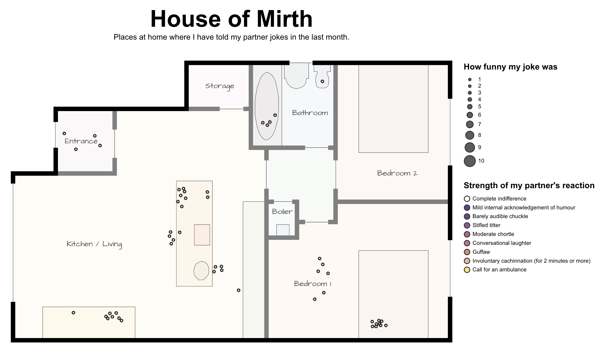

@import "css/litvis.less"

```elm {l=hidden}
import VegaLite exposing (..)
```

# 30 Day Map Challenge, Day 28: Funny

_This document best viewed in [litvis](https://github.com/gicentre/litvis)_

## Initial Thoughts

House of Mirth. Places where I've told jokes and my partner's reaction to them. The joke would be that despite a legend with several levels of laughter response, all responses are in the first "stoney faced" category.

## Data Preparation

1. Floor plan digitized with [LandSerf](http://www.landserf.org) from a plan of our flat.

2. Laughter locations generated manually.

## Map Design

A deadpan architect's basemap of our flat with locations of joke telling overlaid.

```elm {l}
houseOfMirth : Spec
houseOfMirth =
    let
        cfg =
            configure
                << configuration (coView [ vicoStroke Nothing ])

        areaData =
            dataFromUrl "data/floorPlanA.json" [ topojsonFeature "floorPlanA" ]

        lineData =
            dataFromUrl "data/floorPlanL.json" [ topojsonFeature "floorPlanL" ]

        labelData =
            dataFromUrl "data/floorPlanLabels.csv" []

        jokesData =
            dataFromUrl "data/floorPlanJokes.csv" []

        colours =
            categoricalDomainMap
                [ ( "Complete indifference", "white" )
                , ( "Mild internal acknowledgement of humour", "rgb(52,21,104)" )
                , ( "Barely audible chuckle", "rgb(66,25,113)" )
                , ( "Stifled titter", "rgb(119,45,124)" )
                , ( "Moderate chortle", "rgb(151,59,122)" )
                , ( "Conversational laughter", "rgb(184,74,114)" )
                , ( "Guffaw", "rgb(218,101,102)" )
                , ( "Involuntary cachinnation (for 2 minutes or more)", "rgb(241,163,118)" )
                , ( "Call for an ambulance", "rgb(233,228,83)" )
                ]

        proj =
            projection [ prType identityProjection, prReflectY True ]

        roomTrans =
            transform
                << filter (fiExpr "datum.properties.Att != 'Full space'")

        roomEnc =
            encoding
                << color [ mName "properties.Att", mNominal, mLegend [] ]

        roomSpec =
            asSpec
                [ areaData
                , roomTrans []
                , roomEnc []
                , geoshape [ maFillOpacity 0.05, maStroke "black", maStrokeOpacity 0.8, maStrokeWidth 0.5 ]
                ]

        exteriorWallTrans =
            transform
                << filter (fiExpr "datum.properties.Att == 'Exterior Wall'")

        exteriorWallSpec =
            asSpec [ lineData, exteriorWallTrans [], geoshape [ maFilled False, maStroke "black", maStrokeWidth 8 ] ]

        interiorWallTrans =
            transform
                << filter (fiExpr "datum.properties.Att == 'Interior Wall'")

        interiorWallSpec =
            asSpec [ lineData, interiorWallTrans [], geoshape [ maFilled False, maStroke "grey", maStrokeWidth 8 ] ]

        labelEnc =
            encoding
                << position X
                    [ pName "x"
                    , pQuant
                    , pScale [ scDomain (doNums [ 75, 1775 ]), scNice niFalse ]
                    , pAxis []
                    ]
                << position Y
                    [ pName "y"
                    , pQuant
                    , pScale [ scDomain (doNums [ 150, 1230 ]), scNice niFalse ]
                    , pAxis []
                    ]
                << text [ tName "label", tNominal ]

        labelSpec =
            asSpec
                [ labelData
                , labelEnc []
                , textMark [ maAlign haCenter, maFont "Architects Daughter", maFontSize 14, maOpacity 0.7 ]
                ]

        jokesEnc =
            encoding
                << position X
                    [ pName "x"
                    , pQuant
                    , pScale [ scDomain (doNums [ 75, 1775 ]), scNice niFalse ]
                    , pAxis []
                    ]
                << position Y
                    [ pName "y"
                    , pQuant
                    , pScale [ scDomain (doNums [ 150, 1230 ]), scNice niFalse ]
                    , pAxis []
                    ]
                << size
                    [ mName "strength"
                    , mQuant
                    , mScale
                        [ scDomain (doNums [ 1, 10 ])
                        , scRange (raNums [ 20, 400 ])
                        , scType scPow
                        , scExponent 3
                        ]
                    , mLegend
                        [ leTitle "How funny my joke was"
                        , leValues (leNums (List.range 1 10 |> List.map toFloat))
                        , leTitlePadding 10
                        , leTitleFontSize 15
                        , leTitleLimit 400
                        ]
                    ]
                << color
                    [ mName "reaction"
                    , mOrdinal
                    , mScale colours
                    , mLegend
                        [ leTitle "\nStrength of my partner's reaction"
                        , leTitlePadding 10
                        , leTitleFontSize 15
                        , leTitleLimit 400
                        , leLabelLimit 400
                        ]
                    ]

        jokesSpec =
            asSpec [ jokesData, jokesEnc [], circle [ maStroke "black", maOpacity 0.8 ] ]

        res =
            resolve
                << resolution (reScale [ ( chColor, reIndependent ) ])
    in
    toVegaLite
        [ cfg []
        , width 800
        , height 500
        , title "House of Mirth"
            [ tiFontSize 42
            , tiOffset 30
            , tiSubtitle "Places at home where I have told my partner jokes in the last month."
            , tiSubtitleFontSize 14
            ]
        , proj
        , res []
        , layer [ roomSpec, interiorWallSpec, exteriorWallSpec, labelSpec, jokesSpec ]
        ]
```


