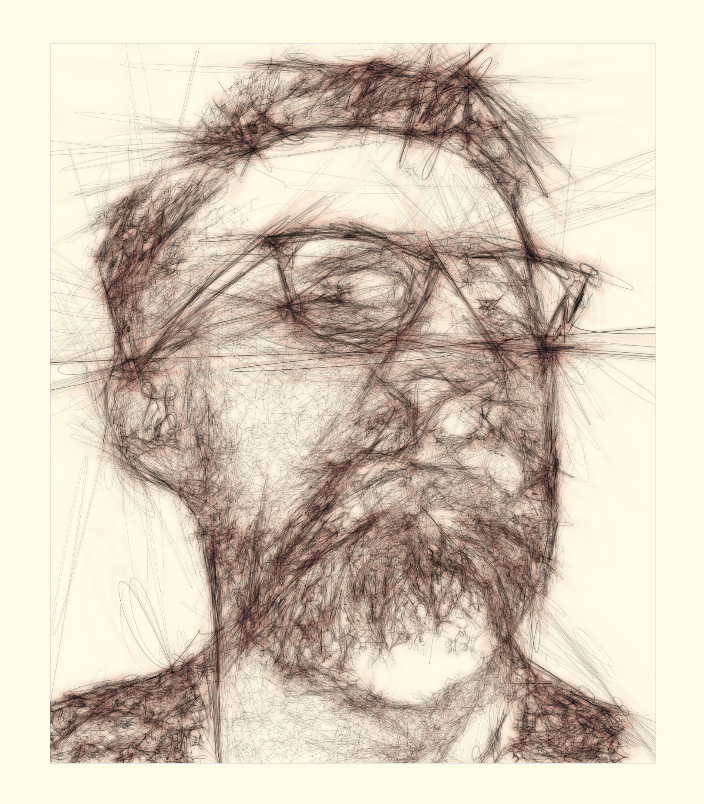

@import "css/litvis.less"

```elm {l=hidden}
import VegaLite exposing (..)
```

# 30 Day Map Challenge, Day 29: Experimental

_This document best viewed in [litvis](https://github.com/gicentre/litvis)_

## Initial Thoughts

Contour lines represented as spines or similar parametric function, but with significant overshooting to create a sketchy feel. Could apply to images as much as terrains.

## Data Preparation

1.  Source images for contour threading converted to black and white with high contrast (using MacOS image preview, but any image package will do).

2.  Blob detection of grey-level boundaries via [this Processing library](http://www.v3ga.net/processing/BlobDetection/).

3.  Contour simplification written in Java (Douglas Peucker) to output simplified contour vertices.

Location of generated files:

```elm {l}
path : String -> String
path file =
    "https://gicentre.github.io/data/30dayMapChallenge/" ++ file
```

## Map Design

The objective is to create a heavily stylised hand-drawn sketchy feel for any source image.

---

### Experiment One: Overshooting contour lines around simple shapes

Starting with some simple polygons around which we will be threading contours.

```elm {l=hidden}
simpleData =
    dataFromColumns []
        << dataColumn "x" (nums [ 20, 30, 50, 65, 65, 63, 10, 20, 20, 10 ])
        << dataColumn "y" (nums [ 10, 30, 10, 50, 30, 45, 60, 60, 50, 50 ])
        << dataColumn "seq" (nums [ 1, 2, 3, 1, 2, 3, 1, 2, 3, 4 ])
        << dataColumn "shape" (nums [ 1, 1, 1, 2, 2, 2, 3, 3, 3, 3 ])
```

```elm {v}
baseShapes : Spec
baseShapes =
    let
        enc =
            encoding
                << position X [ pName "x", pQuant, pScale [ scDomain (doNums [ 0, 80 ]) ] ]
                << position Y [ pName "y", pQuant, pScale [ scDomain (doNums [ 0, 80 ]) ] ]
                << order [ oName "seq" ]
                << detail [ dName "shape" ]
    in
    toVegaLite
        [ width 300
        , height 300
        , simpleData []
        , enc []
        , line [ maFilled True, maColor "grey" ]
        ]
```

We can represent the contours as lines through the polygon vertices, interpolating with a [closed cardinal spline](https://en.wikipedia.org/wiki/Cubic_Hermite_spline#Cardinal_spline). The 'tension' parameter controls how closely the spline is to a linear interpolation between vertices.

```elm {l=hidden}
experiment1 : Float -> Spec
experiment1 tension =
    let
        enc =
            encoding
                << position X
                    [ pName "x"
                    , pQuant
                    , pScale [ scDomain (doNums [ 0, 80 ]) ]
                    , pAxis [ axTitle "", axLabels False ]
                    ]
                << position Y
                    [ pName "y"
                    , pQuant
                    , pScale [ scDomain (doNums [ 0, 80 ]) ]
                    , pAxis [ axTitle "", axLabels False ]
                    ]
                << order [ oName "seq" ]
                << detail [ dName "shape" ]
    in
    toVegaLite
        [ width 200
        , height 200
        , title ("spline tension: " ++ String.fromFloat tension)
            [ tiOffset -20, tiAnchor anEnd, tiFontWeight fwNormal, tiFont "Fjalla One" ]
        , simpleData []
        , enc []
        , line
            [ maTension tension
            , maInterpolate miCardinalClosed
            , maPoint (pmMarker [ maFill "white", maStroke "black", maStrokeWidth 0.7 ])
            ]
        ]
```

A tension value of 1 gives a linear interpolation; as it becomes smaller, the contour becomes more round:

^^^elm {v=(experiment1 1)}^^^ ^^^elm {v=(experiment1 0.5)}^^^ ^^^elm {v=(experiment1 0)}^^^

The trend continues as the tension value becomes negative:

^^^elm {v=(experiment1 -0.5)}^^^ ^^^elm {v=(experiment1 -1)}^^^ ^^^elm {v=(experiment1 -1.5)}^^^

With further increases of negative tension values, new sharp interpolated vertices appear:

^^^elm {v=(experiment1 -2)}^^^ ^^^elm {v=(experiment1 -3)}^^^ ^^^elm {v=(experiment1 -4)}^^^

With extreme tension values we get some wild contour shapes, unconstrained by the original space.
Their fluidity, especially for thin elongated shapes, hints a flourishing signature or bold sketching.

^^^elm {v=(experiment1 -8)}^^^ ^^^elm {v=(experiment1 -10)}^^^ ^^^elm {v=(experiment1 -20)}^^^

---

### Experiment Two: Terrain Contours

Applying the same approach to contour vertices from a digital elevation model:

```elm {l=hidden}
experiment2 : Float -> Spec
experiment2 tension =
    let
        w =
            400

        h =
            w * 212 / 300

        data =
            dataFromUrl (path "experimentalContoursTerrain.csv")
                [ parse [ ( "x", foNum ), ( "y", foNum ), ( "seq", foNum ), ( "shape", foNum ) ] ]

        enc =
            encoding
                << position X [ pName "x", pQuant, pAxis [] ]
                << position Y [ pName "y", pQuant, pAxis [], pSort [ soDescending ] ]
                << order [ oName "seq" ]
                << detail [ dName "shape" ]
    in
    toVegaLite
        [ width w
        , height h
        , data
        , enc []
        , line
            [ maTension tension
            , maInterpolate miCardinalClosed
            , maStrokeWidth 0.7
            , maClip True
            ]
        , title ("spline tension: " ++ String.fromFloat tension)
            [ tiOffset -20, tiAnchor anEnd, tiFontWeight fwNormal, tiFont "Fjalla One" ]
        ]
```

'Glitches' occur when contours are interrupted (typically by the edge of the region).

^^^elm {v=(experiment2 1)}^^^

But things start to look interesting when we change the tension value, producing a messier more sketchy set of contour lines:

^^^elm {v=(experiment2 -2)}^^^

^^^elm {v=(experiment2 -4)}^^^

^^^elm {v=(experiment2 -10)}^^^

---

### Experiment Three: Non-terrain contours

Why not apply the same approach to source images other than terrain? For example faces (this from [Jane Bown's](https://en.wikipedia.org/wiki/Jane_Bown) portrait of Samuel Beckett):

```elm {v interactive}
experiment3 : Spec
experiment3 =
    let
        w =
            600

        h =
            w * 379 / 319

        data =
            dataFromUrl (path "experimentalContoursBeckett.csv")
                [ parse [ ( "x", foNum ), ( "y", foNum ), ( "seq", foNum ), ( "shape", foNum ) ] ]

        enc =
            encoding
                << position X [ pName "x", pQuant, pAxis [] ]
                << position Y [ pName "y", pQuant, pAxis [], pSort [ soDescending ] ]
                << order [ oName "seq" ]
                << detail [ dName "shape" ]
    in
    toVegaLite
        [ width w
        , height h
        , data
        , enc []
        , line
            [ maTension -15
            , maInterpolate miCardinalClosed
            , maStrokeWidth 0.7

            --  , maStroke "black"
            , maOpacity 0.2
            , maClip True
            ]
        ]
```

---

### Experiment Four: Ink and watercolour styling

We can layer multiple sets of contours lines with different thicknesses, spline tension, colour and opacity. Plenty of opportunity for further experimentation.

```elm {l}
experiment5 : Spec
experiment5 =
    let
        w =
            900

        h =
            w * 379 / 319

        data =
            dataFromUrl (path "experimentalContoursJWO.csv")
                [ parse [ ( "x", foNum ), ( "y", foNum ), ( "seq", foNum ), ( "shape", foNum ) ] ]

        enc =
            encoding
                << position X [ pName "x", pQuant, pAxis [] ]
                << position Y [ pName "y", pQuant, pAxis [], pSort [ soDescending ] ]
                << order [ oName "seq" ]
                << detail [ dName "shape" ]

        watercolourSpec1 =
            asSpec
                [ line
                    [ maTension -20
                    , maInterpolate miCardinalClosed
                    , maStrokeWidth 8
                    , maStroke "rgb(150,0,0)"
                    , maOpacity 0.002
                    , maClip True
                    ]
                ]

        watercolourSpec2 =
            asSpec
                [ line
                    [ maTension -14
                    , maInterpolate miCardinalClosed
                    , maStrokeWidth 8
                    , maStroke "rgb(0,0,100)"
                    , maOpacity 0.002
                    , maClip True
                    ]
                ]

        inkSpec =
            asSpec
                [ line
                    [ maTension -12
                    , maInterpolate miCardinalClosed
                    , maStrokeWidth 0.25
                    , maStroke "black"
                    , maOpacity 0.3
                    , maClip True
                    ]
                ]
    in
    toVegaLite
        [ width w
        , height h
        , background "rgb( 256, 250, 230 )"
        , padding (paSize 150)
        , data
        , enc []
        , layer [ watercolourSpec1, watercolourSpec2, inkSpec ]
        ]
```


