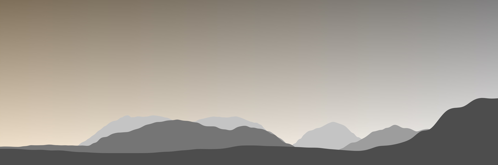

@import "css/litvis.less"

```elm {l=hidden}
import VegaLite exposing (..)
```

# 30 Day Map Challenge, Day 30: Home

_This document best viewed in [litvis](https://github.com/gicentre/litvis)_

## Initial Thoughts

I struggle to define what 'home' means to me. Partly because I think of home as many places, many people and many activities that give me the comfort of belonging. But I write this in the southern Lake District, that has been an important part of my feeling of home for 30 years.

Reflecting on the last month of the _#30DayMapChallenge_ I also wonder if my academic home is as a cartographer, geographer, designer, artist, data visualizer or computer scientist.

I would like to capture these multiple facets of home in my final map this month.

## Data Preparation

Generate a series of terrain profiles of my familiar view looking south towards the Coniston Fells from Wansfell overlooking Ambleside.

1.  Create vectors of along ridge lines in LandSerf, in arcs radiating from a single home viewpoint (western flank of Wansfell).

2.  Extract profiles along horizon points as x,y text files using LandSerf's profile tool)

3.  Scale distance along each profile from 0 to 1 in order to scale for perspective.

4.  Combine profiles in single csv file adding an identifier for each profile.

```elm {l}
path : String -> String
path file =
    "https://gicentre.github.io/data/30dayMapChallenge/" ++ file
```

## Map Design

The intention is to capture the late Autumn colours of the landscape. Low November sun in the afternoon stratifies the landscape giving it an exaggerated sense of depth and a warmth, despite the limited colour palette. I would also like to keep a structure in both Vega-Lite code and visual appearance that reflects my datavis home – these are just area charts showing elevation at selected distances from a single view point.

Vertical scaling with distance is exaggerated, which conveys the relief of the landscape more meaningfully than a "realistic" projection.

```elm {v}
profiles : Spec
profiles =
    let
        w =
            1400

        h =
            w / 3

        cfg =
            configure << configuration (coView [ vicoStroke Nothing ])

        profileData =
            dataFromUrl (path "homeProfiles.csv")
                [ parse [ ( "x", foNum ), ( "elev", foNum ), ( "profileID", foNum ) ] ]

        skyData =
            dataFromColumns []
                << dataColumn "x" (nums [ 0, 1 ])
                << dataColumn "y" (nums [ 500, 500 ])

        trans =
            transform
                << calculateAs "datum.elev / pow(5 - datum.profileID,1.2)" "scaledElev"

        skyEnc =
            encoding
                << position X [ pName "x", pQuant, pAxis [] ]
                << position Y [ pName "y", pQuant, pScale [ scDomain (doNums [ 0, 500 ]) ], pAxis [] ]

        cloudSpec =
            asSpec
                [ skyData []
                , skyEnc []
                , area
                    [ maOpacity 0.5
                    , maFillGradient grLinear
                        [ grX1 1
                        , grY1 1
                        , grX2 1
                        , grY2 0
                        , grStops [ ( 0, "white" ), ( 1, "black" ) ]
                        ]
                    ]
                ]

        sunSpec =
            asSpec
                [ skyData []
                , skyEnc []
                , area
                    [ maOpacity 0.4
                    , maFillGradient grLinear
                        [ grX1 1
                        , grY1 1
                        , grX2 0
                        , grY2 1
                        , grStops [ ( 0, "white" ), ( 1, "rgb(255,165,0)" ) ]
                        ]
                    ]
                ]

        profileEnc =
            encoding
                << position X [ pName "x", pQuant, pAxis [] ]
                << position Y
                    [ pName "scaledElev"
                    , pQuant
                    , pScale [ scDomain (doNums [ 0, 500 ]) ]
                    , pAxis []
                    ]
                << color
                    [ mName "profileID"
                    , mOrdinal
                    , mScale [ scScheme "greys" [ 0, 1 ] ]
                    , mLegend []
                    ]

        profileSpec =
            asSpec
                [ profileData
                , trans []
                , profileEnc []
                , area [ maInterpolate miBasis, maOpacity 1 ]
                ]
    in
    toVegaLite
        [ cfg []
        , width w
        , height h
        , layer [ sunSpec, cloudSpec, profileSpec ]
        ]
```


